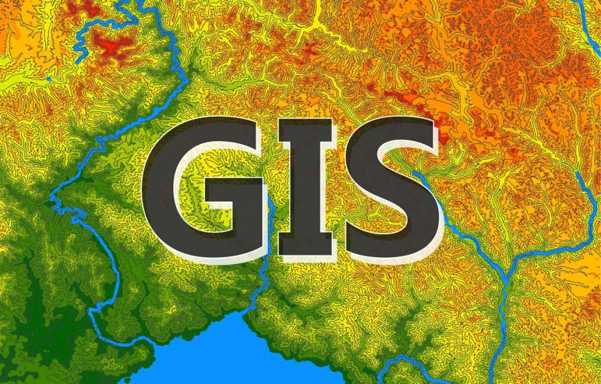

# Introduction to Geographic Information Systems



An open-source, comprehensive online course for learning GIS fundamentals. Built with MkDocs Material.

🌐 **Live Site**: [https://kashingtondc.github.io/CPGIS](https://kashingtondc.github.io/CPGIS)

## About

This course provides a complete introduction to Geographic Information Systems, covering:

- Core GIS concepts and spatial thinking
- Vector and raster data models
- Coordinate systems and projections
- Spatial analysis techniques
- Remote sensing fundamentals
- Hands-on labs with QGIS and ArcGIS Pro
- Real-world applications and projects

Perfect for undergraduate students, self-learners, and professionals wanting to add GIS skills.

## Features

✅ **Free and Open Source** - No cost, no barriers
<br>✅ **Software Agnostic** - Learn concepts that apply to any GIS
<br>✅ **Hands-On Labs** - Practical exercises with real data
<br>✅ **Interactive Maps** - Embedded visualizations
<br>✅ **Modern Design** - Beautiful, responsive interface
<br>✅ **Self-Paced** - Learn at your own speed

## Quick Start

### For Students/Learners

Visit the [live course website](https://kashingtondc.github.io/CPGIS) and start learning!

### For Instructors (Forking/Customizing)

1. **Fork this repository**
   ```bash
   # Click "Fork" on GitHub, then clone your fork
   git clone https://github.com/YOUR-USERNAME/CPGIS.git
   cd CPGIS
   ```

2. **Install dependencies**
   ```bash
   pip install -r requirements.txt
   ```

3. **Run locally**
   ```bash
   mkdocs serve
   ```
   Open [http://127.0.0.1:8000](http://127.0.0.1:8000)

4. **Customize content**
   - Edit markdown files in `docs/`
   - Modify navigation in `mkdocs.yml`
   - Add your own images, data, and examples

5. **Deploy to GitHub Pages**
   ```bash
   mkdocs gh-deploy
   ```
   Or use the included GitHub Actions workflow (see below)

## Repository Structure

```
CPGIS/
├── docs/                          # Course content
│   ├── index.md                   # Homepage
│   ├── getting-started/           # Software setup, resources
│   ├── topics/                    # 15 main topics
│   ├── labs/                      # Hands-on lab exercises
│   ├── assignments/               # Project assignments
│   ├── reference/                 # Glossary, data sources, FAQs
│   ├── images/                    # Images and diagrams
│   ├── maps/                      # Interactive map files
│   └── assets/                    # CSS, JavaScript
├── mkdocs.yml                     # MkDocs configuration
├── requirements.txt               # Python dependencies
├── .github/workflows/             # GitHub Actions (auto-deploy)
├── README.md                      # This file
└── LICENSE                        # MIT License
```

## Course Topics

1. **What is GIS?** - Introduction and applications
2. **Spatial Data Models** - Vector and raster data
3. **Coordinate Systems & Projections** - CRS, datums, transformations
4. **Data Creation & Editing** - Digitizing, topology
5. **Table Management & Joins** - Attribute data, queries
6. **Vector Geoprocessing** - Buffer, clip, intersect, union
7. **Field Data & GPS** - GPS data collection and integration
8. **Raster Data & DEMs** - Elevation, terrain analysis
9. **Raster Analysis** - Map algebra, reclassification
10. **Remote Sensing Fundamentals** - Satellite imagery, spectral indices
11. **Interpolation & Zonal Statistics** - Creating surfaces
12. **Workflow Design** - Model builder, automation
13. **Advanced Topics** - Network analysis, 3D, time series
14. **Modern Mapmaking** - Web GIS, story maps
15. **Synthesis** - Integration and final projects

## Automated Deployment

This repository includes a GitHub Actions workflow for automatic deployment:

1. Any push to `main` branch triggers build
2. MkDocs builds the static site
3. Site deploys to GitHub Pages
4. Available at `https://YOUR-USERNAME.github.io/CPGIS`

**To enable:**
1. Go to repository **Settings → Pages**
2. Set **Source** to "GitHub Actions"
3. Push changes to `main` branch

## Contributing

Contributions are welcome! Ways to contribute:

- **Report issues**: Found an error? Open an issue
- **Suggest improvements**: Have ideas? Start a discussion
- **Add content**: Submit pull requests with new material
- **Share examples**: Contribute lab data or case studies
- **Fix typos**: Even small fixes help!

See [CONTRIBUTING.md](CONTRIBUTING.md) for guidelines.

## Building Locally

### Prerequisites

- Python 3.8+
- pip

### Setup

```bash
# Clone the repository
git clone https://github.com/kashingtondc/CPGIS.git
cd CPGIS

# Create virtual environment (optional but recommended)
python -m venv venv
source venv/bin/activate  # On Windows: venv\Scripts\activate

# Install dependencies
pip install -r requirements.txt

# Serve locally
mkdocs serve

# Build static site
mkdocs build  # Output in site/ directory
```

## Customization

### Branding

Edit `mkdocs.yml`:
```yaml
site_name: Your Course Name
site_author: Your Name
repo_url: https://github.com/kashingtondc/your-repo
```

### Colors

Edit `mkdocs.yml` theme colors:
```yaml
theme:
  palette:
    primary: teal  # Change to your color
    accent: green
```

### Content

All course content is in markdown files under `docs/`. Simply edit these files and the site regenerates automatically.

## License

This course is licensed under the [MIT License](LICENSE).

You are free to:
- ✅ Use this course for teaching
- ✅ Modify and adapt the content
- ✅ Create derivatives
- ✅ Use commercially

Just provide attribution back to this repository!

## Acknowledgments

This course was developed by **Dr. Aakash Ahamed** at Cal Poly San Luis Obispo.

Inspired by and adapted from materials developed for NR 218 - Introduction to GIS.

Built with:
- [MkDocs](https://www.mkdocs.org/)
- [Material for MkDocs](https://squidfunk.github.io/mkdocs-material/)
- [Leaflet](https://leafletjs.com/) for interactive maps

## Support

- 📖 [Course Documentation](https://kashingtondc.github.io/CPGIS)
- 💬 [Discussions](https://github.com/kashingtondc/CPGIS/discussions)
- 🐛 [Issue Tracker](https://github.com/kashingtondc/CPGIS/issues)
- 📧 Email: aaahamed@calpoly.edu

## Citation

If you use this course in your teaching or research, please cite:

```
Ahamed, A. and Ericson, J. (2026). Introduction to Geographic Information Systems: 
An Open-Source Online Course. GitHub repository. 
https://github.com/kashingtondc/CPGIS
```

---

**Star ⭐ this repository if you find it useful!**

Made with ❤️ for the GIS education community
