# Software Setup

This course contains lab materials and step-by-step instructions for both QGIS and ArcGIS Pro. The fundamental processing skills you will practice in this course are not exclusive to any particular software and are transferrable to any GIS program or geospatial code library you may encounter in your career. 

## Choosing Software

For this course, instructions are provided for both QGIS and ArcGIS Pro, and you are welcome to use use any GIS software of your choice to complete lab activities. To help you understand the implications of using each program, the table below explains some of the key differences:

|  | QGIS | ArcGIS |
| ------------- | ---- | ----- |
|  | {width=300} | {width=300} |
| Licensing | No license required, QGIS is **Free Forever** thanks to its Open Source license | :fontawesome-solid-sack-dollar: **Expensive license** dependent on University or Employer |
| Compatibility | **:fontawesome-brands-apple: MacOS, :fontawesome-brands-linux: Linux, and :fontawesome-brands-windows: Windows** | **:fontawesome-brands-windows: Windows Only** |
| Community and development | [Open Source](https://opensource.com/resources/what-open-source) with regular updates and community-based Documentation | [ESRI](https://en.wikipedia.org/wiki/Esri) releases new versions annually and maintains documentation and forums |
| Use | Used by GIS analysts World-Wide |  Standard in US Government Agencies |

!!! Tip "Which GIS program should I use??"
      To get the most out of this course, it is recommended that you try using **both** QGIS and ArcGIS Pro. 
      
      If you choose to focus on **one** program, it is recommended that you use **QGIS** because:

      - QGIS is **free forever** and available on both Windows and MacOS
      - It is **easier to pick up ArcGIS after learning QGIS**, but can be harder to learn QGIS if you start with ArcGIS

---
## QGIS
 
### Installing QGIS (recommended)

**Compatible with :fontawesome-brands-apple: MacOS, :fontawesome-brands-linux: Linux, and :fontawesome-brands-windows: Windows**

1. Visit [https://qgis.org/download/](https://qgis.org/download/){:target="_blank"}
2. Download the **Long Term Release (LTR)** version for stability and best plugin compatibility
3. Run the installer and follow prompts
4. Default settings are fine for most users

!!! warning "Mac Error"
      If you encounter an error on mac saying *"QGISX.XX.app" can't be open because Apple cannot check it for malicious software* you will need to manually approve the installation

      1. Open **System Preferences**
      2. Navigate to the **Privacy tab**
      3. Find the prompt that says QGIS cannot be installed and press the **Allow** button

### Installing QGIS Plugins
For this course we will make use of a variety of plugins to add features and tools that QGIS does not include by default. Please follow the following steps to install **QuickMapServices**

1. Open QGIS

<figure markdown>
  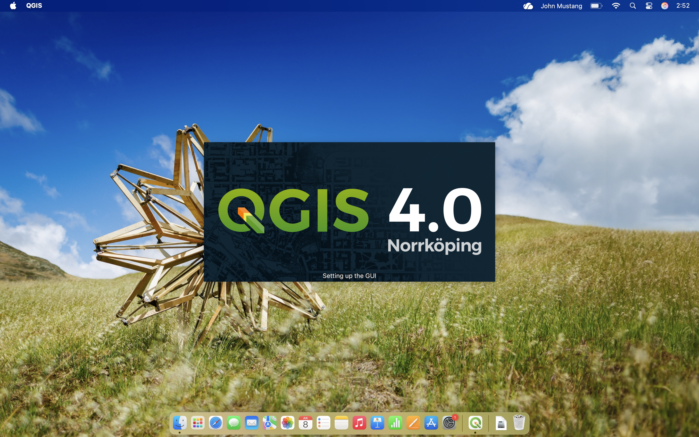
</figure>

<figure markdown>
  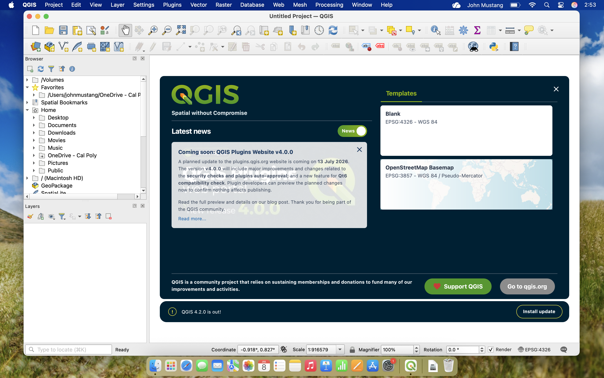
</figure>

2. In the menubar, navigate to *Plugins -> Manage and Install Plugins* to open the plugin manager 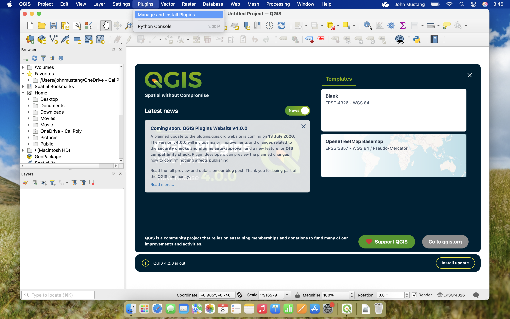
3. Search for "QuickMapServices" in the Plugin manager and select the "NextGIS QuickMapServices" Plugin 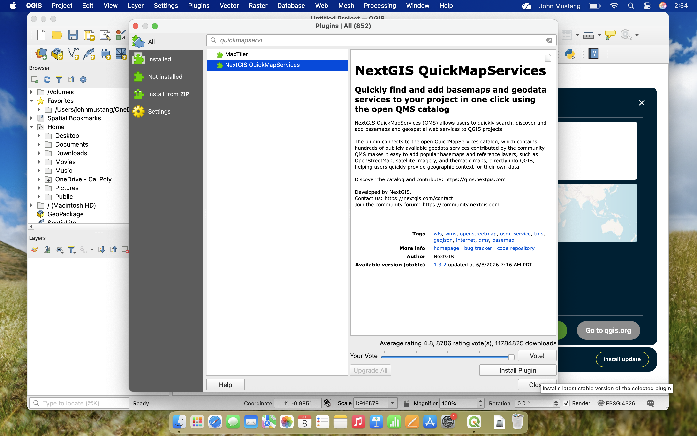
4. Press the **Install Plugin** button and close the Plugin Manager
5. Installing the QuickMapServices adds the QMS **toolbar and panel** to your QGIS Workspace
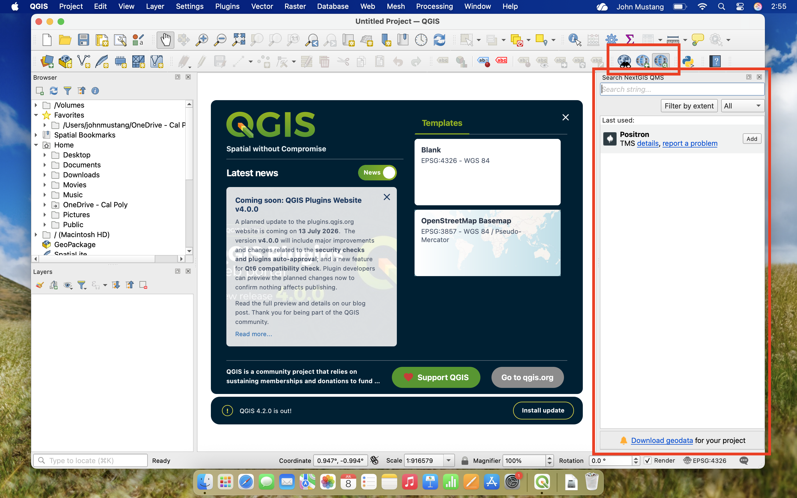
6. You can now add basemaps to your QGIS projects by searching for tiles such as "Open Street Maps", "Google Satellite", or "ESRI Gray" 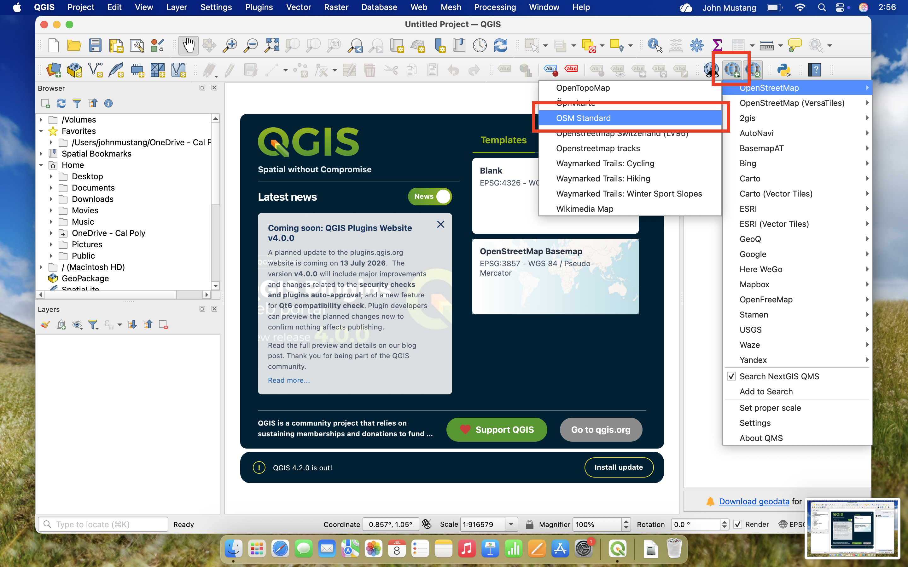

### Verify Your QGIS Installation

1. Launch QGIS Desktop
2. Go to **Layer → Add Layer → Add Vector Layer**
3. Can you see the file browser?
4. Close QGIS

✅ If yes, you're ready! [:octicons-arrow-right-24: Set up your file system](../getting-started/storage-and-file-management.md)

---

## ArcGIS Pro

**ArcGIS Pro** by ESRI is the industry-standard GIS software used by many organizations. It's powerful but requires a license.

### Installing ArcGIS Pro 
**Compatible with :fontawesome-brands-windows: Windows Only**

1. Visit [https://calpoly.maps.arcgis.com/home/index.html](https://calpoly.maps.arcgis.com/home/index.html) and click **Sign In** in the top right 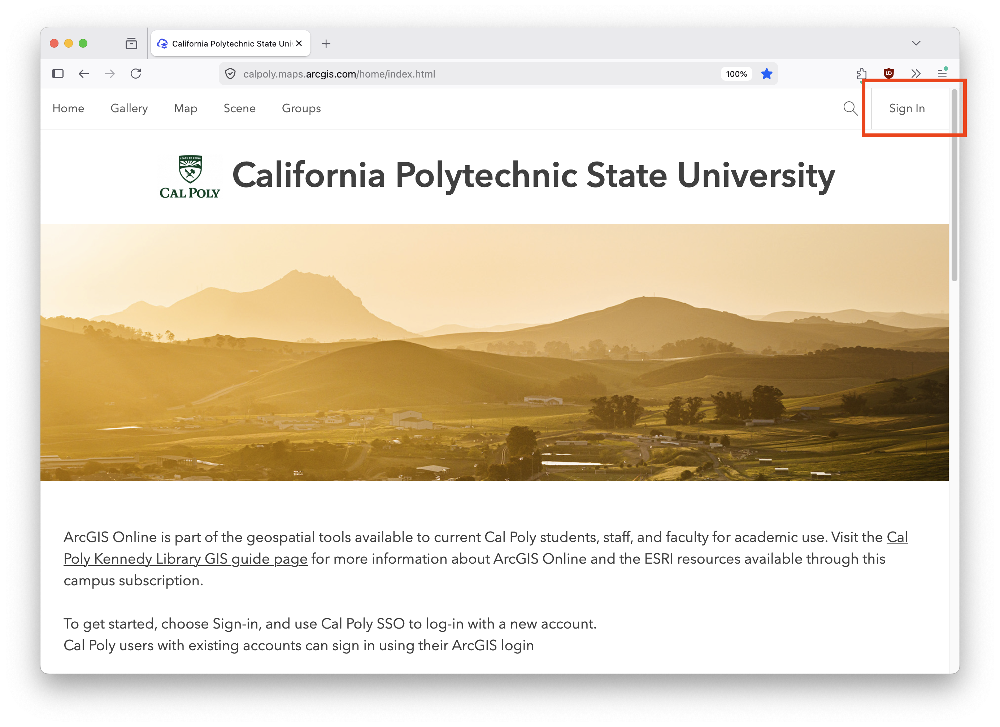
2. Click **Cal Poly SSO** and sign in with your Cal Poly Credentials 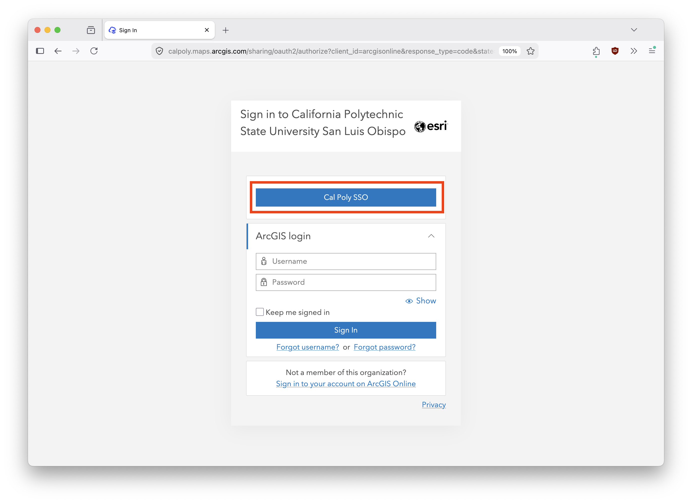
3. Navigate to **My settings** by clicking your profile in the top right 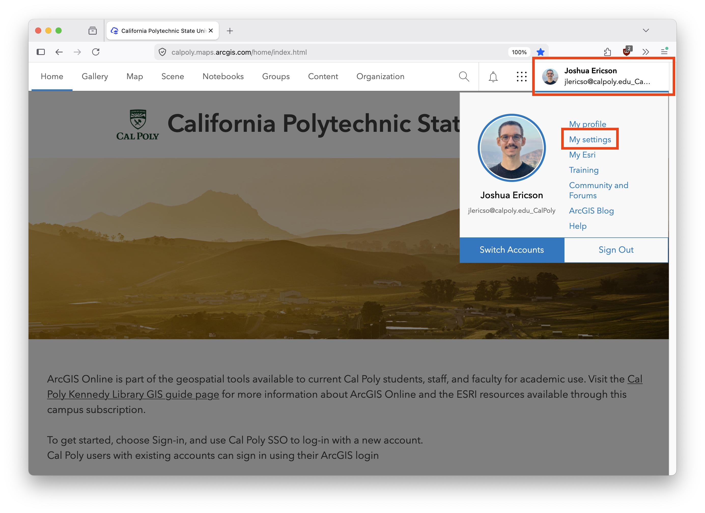
4. Switch to the **Licenses tab** and click the download button next to ArcGIS Pro 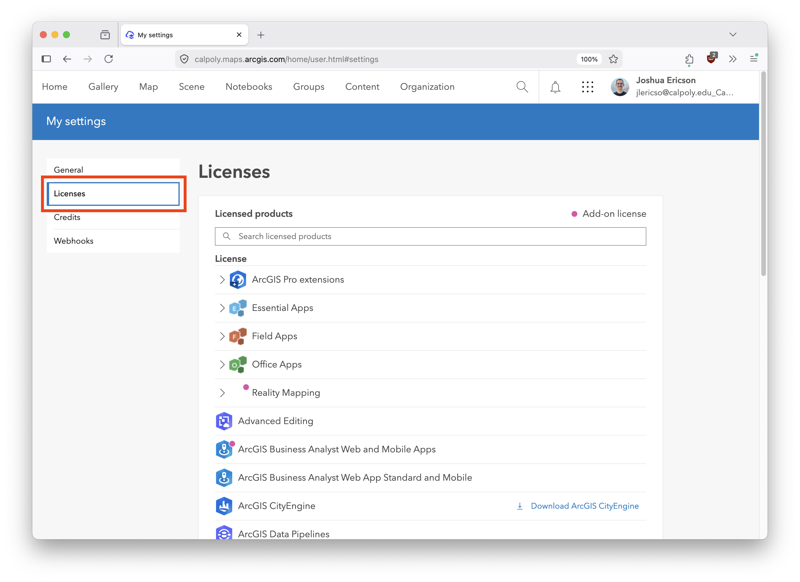
5. Select and Download the latest version 
6. Run the installer (*ArcGISPro_37_199633.exe*)and follow the prompts
      - Note that the install wizard may prompt you to install the [.NET runtime](https://dotnet.microsoft.com/en-us/download/dotnet/8.0)
7. Once installed, launch the **ArcGIS Pro** and sign in with your Cal Poly Credentials. 
      - The install screen will show this login screen, select **Your organization's url** and type **calpoly** 
      - Sign in with **Cal Poly SSO** 

<figure markdown>
   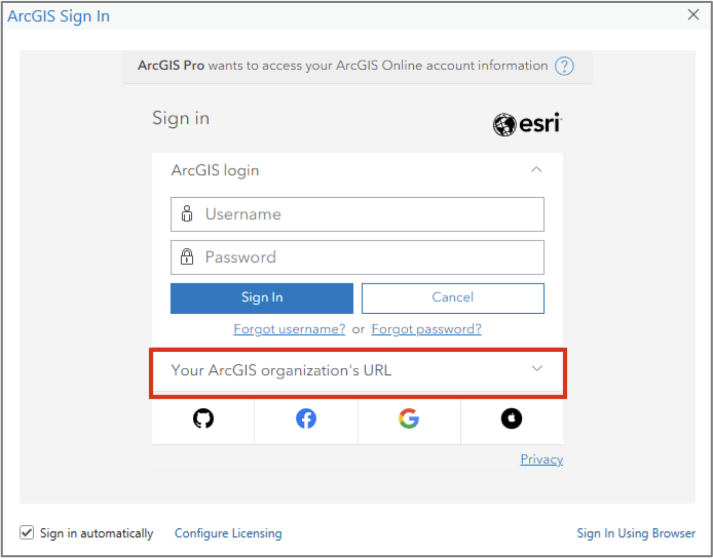
</figure>

<figure markdown>
   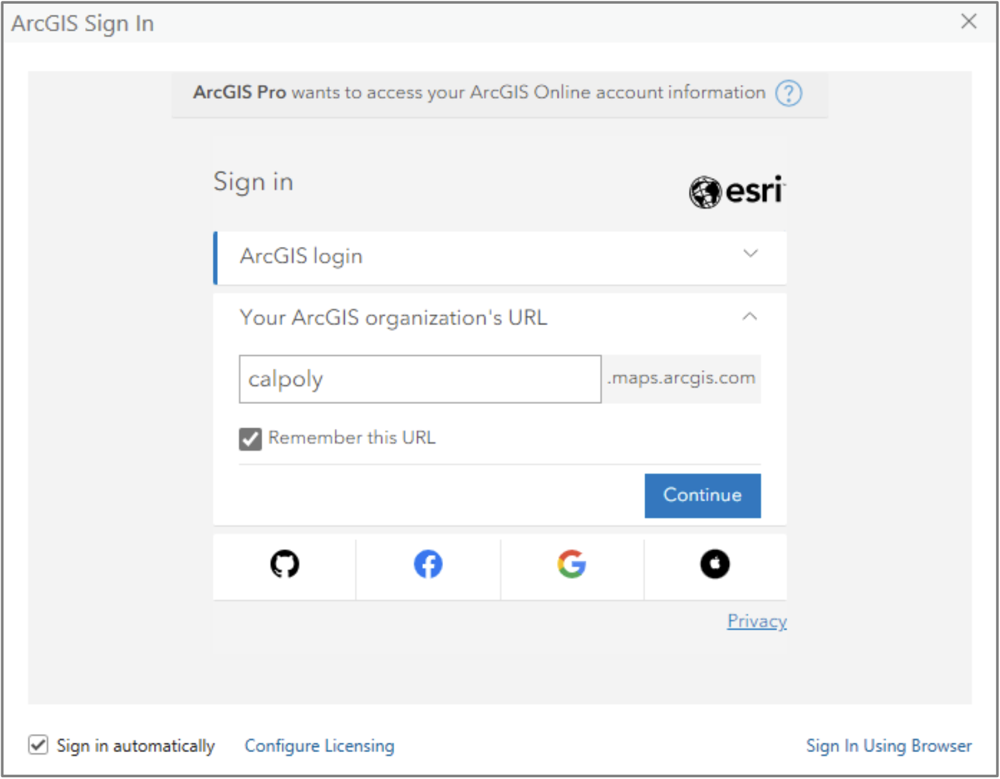
</figure>

8. Your license should now be active, if you have any issues, contact the Cal Poly GIS administrator at [lib-gis@calpoly.edu](mailto:lib-gis@calpoly.edu)

### Verify your ArcGIS Pro Installation

1. Launch ArcGIS Pro
2. Create a new project
3. Can you see the ribbon and catalog pane?
4. Close ArcGIS Pro

✅ If yes, you're ready! [:octicons-arrow-right-24: Set up your file system](../getting-started/storage-and-file-management.md)

