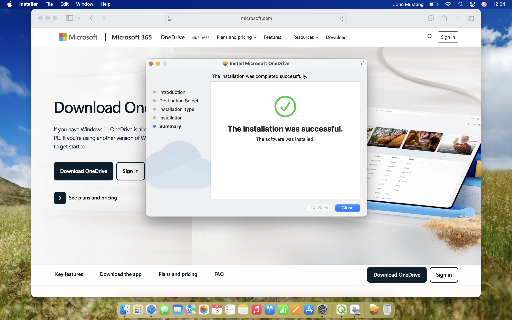
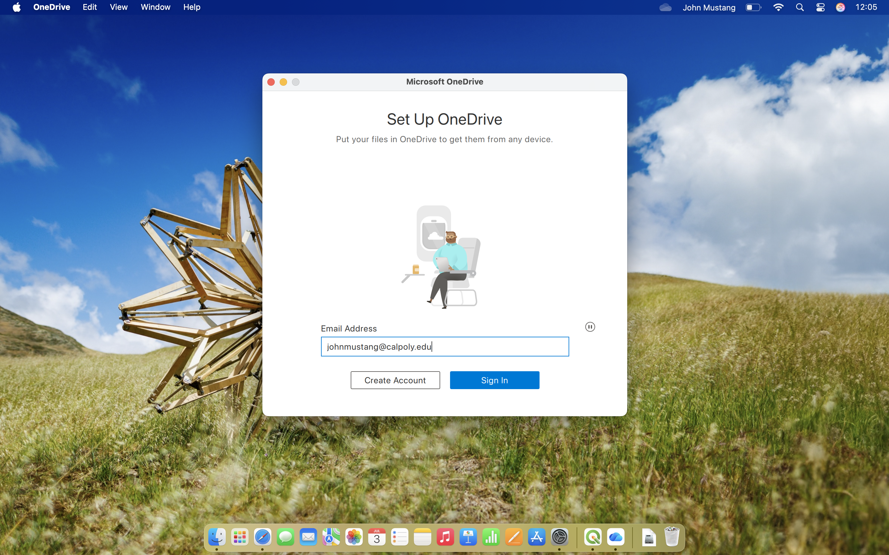

## Introduction to file managment

GIS projects are rarely self-contained. A single project can utilize dozens of shapefiles, rasters, geodatabases, each stored as a separate file on your computer. Unlike many other types of software, desktop GIS platforms don't store your data *inside* the project file and instead *reference* data files wherever they are stored on your computer. 

Developing good file management habits now, by being consistent with where and how you store your files will save you hours of troubleshooting down the road. It is a skill that is direcly applicable to real-world GIS work, and where projects often involve large teams, shared drives, and tidy project archival.

## Cloud Storage Setup

For this course, it is reccomended that you store project data in a cloud storage system, instead of keeping them locally. 

**Benefits:**

- You can access files from any computer (lab or personal)
- Your files are automaticlly backed up
- It is easy to share files for gorup projects

### OneDrive (Recommended for Cal Poly Students)

For this course, it is highly recommended that you use OneDrive. For one, Cal Poly provides students with **500GB** of OneDrive storage while you are enrolled. Following the instructions below, you can use OneDrive just like any other folder on your computer, no need to open the OneDrive website in your browser.

**Setup:**

1. Download [OneDrive](https://www.microsoft.com/en-us/microsoft-365/onedrive/download) on your personal computer { align=right width="400"}
2. Sign in with your Cal Poly credentials { align=right width="400"}
3. Create a folder structure for this course:
   ```
   OneDrive/
   └── GIS_Course/
       ├── Labs/
       ├── Projects/
       ├── Data/
       └── Maps/
   ```
4. Set this folder to sync locally by right clicking the *GIS_Course* folder and selecting *Always Keep on This Device*

!!! tip "Pro Tip"
    Create a folder for each GIS project in your synced OneDrive folder. This way:
    
    - Projects are automatically backed up
    - You can pick where you left off from any computer
    - No lost work if your computer crashes!

### Alternative: Google Drive

If not using OneDrive:

1. Install [Google Drive Desktop](https://www.google.com/drive/download/)
2. Create similar folder structure
3. Note: Storage may be more limited than your Cal Poly One Drive

---
## File Management in GIS

GIS projects rely on links between your project file and the data it references, whether they are shapefiles, rasters, geodatabases, or other file formats. Unlike a Word document, an ArcGIS project (.aprx) or QGIS (.qgz) doesn't actually contain your data. Instead, these project files store *paths* pointing the computer to where that data is stored in the filesystem. If you move, rename, or delete a file after adding it to your map, your GIS software will no longer be able to find it, and you'll see the dreaded red exclamation point (!) next to that layer in the Contents pane.


To avoid file errors, we recommend a folder for your project in OneDrive *before* you open your GIS software 

=== "QGIS"
    **For Each GIS Project**

    1. Open File Explorer (Windows) or Finder (MacOS)
    2. Navigate to your **~/OneDrive/GIS_Course/Projects** folder
    3. Create a new folder for the project Ex: **~/OneDrive/GIS_Course/Projects/Project01**
    4. Drag all the data for the project into your project folder

    !!! Tip
        Consider creating subfolders for your original data, processed data, or exported maps to keep project folders clean as you work on them.

    

=== "ArcGIS Pro"
    
    1. When you create a new project, set the save location to 

Effective file organization and computer hygiene are essential skills for success in this course. Knwoing where your files are stored ensures that your project files will remain functional when you work across multiple sessions, switch computers, or make a mistake. 

### Breaking the System


---

## Additional Software (Optional but Useful)

### Text Editor

For working with code or data files:

- **VS Code**: [code.visualstudio.com](https://code.visualstudio.com/) (recommended)
- **Notepad++**: Windows only
- **Sublime Text**: Cross-platform

### Python Setup (For Advanced Users)

Some labs may include optional Python exercises:

```bash
# Install Anaconda (includes Python + data science libraries)
# Download from: https://www.anaconda.com/download

# Create GIS environment
conda create -n gis python=3.11
conda activate gis
conda install -c conda-forge geopandas rasterio folium
```

Useful Python GIS libraries:
- **GeoPandas**: Vector data manipulation
- **Rasterio**: Raster data I/O
- **Folium**: Interactive web maps
- **Shapely**: Geometric operations

### GDAL/OGR

Command-line tools for geospatial data:

- Included with QGIS
- Separate install: [gdal.org](https://gdal.org/)
- Useful for batch processing

---


## File Organization Best Practices

### Folder Structure

Create a clear hierarchy:

```
GIS_Course/
│
├── Labs/
│   ├── Lab01/
│   │   ├── Data/
│   │   ├── Lab01_Project.qgz (or .aprx)
│   │   └── Lab01_Map.pdf
│   ├── Lab02/
│   └── ...
│
├── Projects/
│   ├── Project01/
│   └── ...
│
├── Data/
│   ├── Downloaded/
│   ├── Created/
│   └── Reference/
│
└── Documentation/
    └── notes.md
```

### File Naming Conventions

!!! success "Good Practices"
    - Use descriptive names: `watershed_boundary.shp` not `data1.shp`
    - No spaces: Use underscores or hyphens
    - Include dates: `fire_perimeter_2024-08-15.gpkg`
    - Lowercase is easier: `my_project` not `My_Project`

!!! danger "Avoid"
    - Special characters: `&, *, ?, <, >`
    - Spaces in folder names
    - Very long names (> 50 characters)

---

## Getting Help

### QGIS Resources

- **Official Documentation**: [docs.qgis.org](https://docs.qgis.org/)
- **Tutorials**: [qgistutorials.com](https://www.qgistutorials.com/)
- **YouTube**: QGIS Official Channel
- **Community**: GIS StackExchange

### ArcGIS Pro Resources

- **Official Documentation**: [pro.arcgis.com](https://pro.arcgis.com/en/pro-app/latest/help/main/welcome-to-the-arcgis-pro-app-help.htm)
- **Learn ArcGIS**: [learn.arcgis.com](https://learn.arcgis.com/)
- **ESRI Community**: [community.esri.com](https://community.esri.com/)
- **YouTube**: ESRI Training Videos

### General GIS Help

- **GIS Stack Exchange**: [gis.stackexchange.com](https://gis.stackexchange.com/)
- **Reddit r/gis**: [reddit.com/r/gis](https://www.reddit.com/r/gis/)
- **Discord/Slack**: Many GIS communities

---

## Troubleshooting Common Issues

### "Can't see my files"

- Check file extensions are not hidden (Windows: View → File name extensions)
- Ensure you're looking in the right folder
- Files may be in Downloads instead of your project folder

### "Software crashes when opening large files"

- Your computer may not have enough RAM
- Try using lab computers with better specs
- Simplify/subset your data

### "Projection errors or features not visible"

- Check that all layers use compatible coordinate systems
- Use "Zoom to Layer" to find your data
- Verify the data actually has coordinate information

### "Can't install plugins (QGIS)"

- Check internet connection
- Go to Settings → Options → Network: Ensure proxy settings are correct
- Try from a different network

---

## Ready to Start?

Once your software is installed:

1. ✅ Verify installation works
2. ✅ Set up cloud storage
3. ✅ Create folder structure
4. ✅ Bookmark help resources

[:octicons-arrow-right-24: Start with Topic 1: What is GIS?](../topics/01-what-is-gis.md)

---

**Need More Help?**

If you encounter installation issues, check with:
- Your university's IT help desk
- GIS lab staff
- Course instructor during office hours
