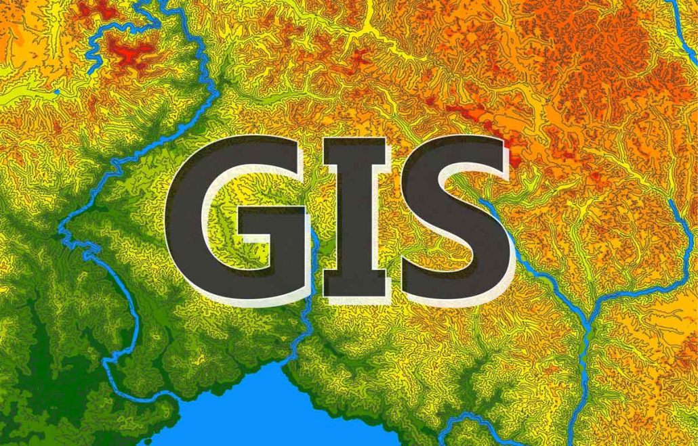

# Introduction to Geographic Information Systems

*Welcome to Introduction to GIS*

Welcome to the online course on **Introduction to Geographic Information Systems (GIS)**! 🌎 🛰️ 🗺️ 📍

## About This Course

GIS is a powerful set of technologies that much of our modern world depends on! Think about Google Maps, GPS, weather forecasts, and so much more - spatial data is how we think about navigating and describing our world, and maps have been around for thousands of years. 

Now, with the explosion of satellites, drones, and other sensors to collect "remote sensing data", GIS has never been more important, and there's never been a more exciting time to learn about it. GIS is also a very marketable career skill!

## What You'll Learn

In this course, you'll:

- **Analyze** various types of spatial data and create maps documenting your interpretations
- **Master** geospatial software packages (QGIS and ArcGIS Pro)
- **Apply** GIS principles to solve real-world problems
- **Understand** remote sensing concepts and digital image processing
- **Develop** your own geospatial projects

## Course Philosophy: Active Learning

!!! note "Growth Mindset Required"
    You will **not** be 'spoon fed' information in this course. Learning GIS is not about sequential button clicking - it requires getting your hands dirty with data, seeking out answers, thinking critically, and having natural curiosity.

Technical challenges will arise, but having a **growth mindset** over a **fixed mindset** is critical to success. If you encounter problems, that's not a sign of failure - it's an opportunity to learn!

## Course Structure

This course is organized into **15 main topics**, each covering fundamental concepts in GIS:

-   :material-map-marker-question:{ .lg .middle } __What is GIS?__

    ---

    Understand what GIS is, its components, and applications in environmental, social, and engineering contexts

    [:octicons-arrow-right-24: Start here](topics/01-what-is-gis.md)

-   :material-vector-polygon:{ .lg .middle } __Spatial Data Models__

    ---

    Learn about vector vs. raster data, points, lines, polygons, and attribute tables

    [:octicons-arrow-right-24: Explore data models](topics/02-spatial-data-models.md)

-   :material-earth:{ .lg .middle } __Coordinate Systems__

    ---

    Master projections, datums, and coordinate reference systems

    [:octicons-arrow-right-24: Learn projections](topics/03-coordinate-systems.md)

-   :material-tools:{ .lg .middle } __Geoprocessing Tools__

    ---

    Perform spatial analysis with buffers, clips, intersections, and more

    [:octicons-arrow-right-24: Process data](topics/06-vector-geoprocessing.md)

-   :material-satellite-variant:{ .lg .middle } __Remote Sensing__

    ---

    Understand satellite imagery, spectral indices, and image analysis

    [:octicons-arrow-right-24: Analyze imagery](topics/10-remote-sensing.md)

-   :material-chart-line:{ .lg .middle } __Raster Analysis__

    ---

    Work with continuous surfaces, DEMs, and map algebra

    [:octicons-arrow-right-24: Analyze rasters](topics/09-raster-analysis.md)

## Hands-On Learning

Each topic includes:

- **📖 Lecture Content**: Core concepts explained with diagrams and examples
- **🧪 Lab Exercises**: Practical exercises to apply what you've learned
- **📊 Assignments**: Projects that build your GIS portfolio
- **🗺️ Interactive Maps**: Embedded visualizations to explore concepts

## Software

We'll use industry-standard GIS software:

- **QGIS** - Free and open-source GIS
- **ArcGIS Pro** - Industry standard (ESRI)

Both are powerful tools for processing, analyzing, and visualizing geographic data. By mastering the core concepts, you'll be able to work with any GIS software.

## Prerequisites

This course is designed for undergraduate students with:

- Basic computer literacy
- Curiosity about maps and spatial data
- Willingness to problem-solve and learn independently

No prior GIS experience is required!

## Getting Started

Ready to begin? Here's what to do:

1. **[Set up your software](getting-started/software-setup.md)** - Install QGIS and/or ArcGIS Pro
2. **[Review course resources](getting-started/resources.md)** - Explore textbooks, tutorials, and data sources
3. **[Start with Topic 1](topics/01-what-is-gis.md)** - Dive into "What is GIS?"

---

💡 Study Tips

- Work through topics in order - they build on each other
- Complete labs hands-on - reading alone won't teach you GIS
- Join online communities for help (GIS Stack Exchange, Reddit r/gis)
- Practice with your own data and questions
- Document your workflows - you'll need them later!

---

**Questions or feedback?** Open an issue on [GitHub](https://github.com/yourusername/gis-course) or contribute improvements!

*This course is open-source and continuously evolving. Last updated: February 2026*
