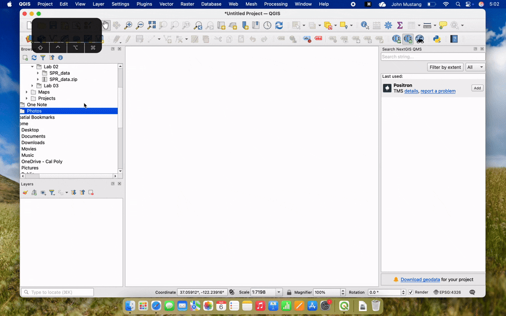

# Lab 2: Exploring Vector Data and Attribute Tables

!!! info "Lab Overview"
    **Topic**: Vector Data and Attributes
     **Time Required**: 2-3 hours
     **Software**: QGIS or ArcGIS Pro

---

## Lab Preparation
 [:fontawesome-solid-download: Download Lab 2 Data](https://drive.google.com/drive/folders/1i2dlbAbyeRk6xbc8SNUn_4tNq5rCAsg5?usp=drive_link){ .md-button }

1. Download the lab data from Google Drive using the link above
2. Place the data in a new folder in your OneDrive for this lab ~/OneDrive/GIS_Courses/Labs/Lab-02. 
3. Unzip the Data file. 
    -On windows, right click the SPR_data.zip file and choose "Extract All". 
    -On mac, double click the .zip file to extract.
4. Create a new map project in QGIS or ArcGIS and save it to your Lab-02 folder

---

## Introduction

In this lab you will explore data from Cal Poly's [Swanton Pacific Ranch](https://spranch.calpoly.edu/) (SPR) to learn the basics of loading and using the attribute table for vector data in GIS. 

!!! note "Placeholder Learning Objectives"
    This lab is under development. It will cover:
    
    - Loading different vector geometry types
    - Exploring attribute tables
    - Basic layer Symbology
    - Selecting features by attribute
    - Selecting features by location
    - Adding and calculating fields
    - Exporting selected features

---

## Task 1: Loading Vector Data

=== "QGIS"

    1. In the **Browser Panel** of your Lab-02 QGIS Project, navigate to the GIS_Courses/Labs/Lab-02 folder in your one drive. 
    

    2. In the **Browser Panel**, expand the SPR_Data folder from the lab data folder you downloaded and unzipped. 
    

    3. Select all the files within the SPR_Data folder. 
    

    4. Add all the layers to your map by dragging them to map canvas or layers panel, or simply by double clicking.
    

    5. The layer should now appear in the **Layers Panel** and the data is on the map canvas.
    

=== "ArcGIS"

    1. 

!!! Question "Question 1"
    
    What vector **geometry type** are the **sprRainGages**, **sprRailroads**, and **sprSoil** layers?

    **Hint:** Right click a layer and select properties. You will see the layer's geometry metadata in the information tab.

!!! Tip "Bulk Selecting Using Command/Control and Shift"

    Select multiple files by holding the **command** on mac/**control** on windows and clicking each file. 
    
    You can also use **shift** to select all files in a list by holding shift and clicking on the first then last file in the list while holding shift.

---

## Task 2: Exploring and Visualizing the Data

The data for this lab is all vector data, but their geometry types are not all the same. 

Layers such *sprSprings* and *sprFlumes* are points, while the *waterlines* and *sprRailroads* layers are lines. The *sprLanduse* and *sprParcels* layers represent the polygon geometry.

In this Task, we will explore how vector data stores information about features and use symbology to show those attributes on a map.

### Exploring Vector Data

=== "QGIS"

    1. With all the SRP layers added, some are not visible because they are under other layers. 
    

    2. In the layers panel, you can use the checkbox to hide and show layers, and click and drag layers to change the drawing order. 
    

    3. For this activity, we wil use **sprFlumes**, **sprStreams**, and **sprLanduse**. Hide all other layers and reorder these three layers in this order so that all of the data is visible.
    

    4. To explore the attributes of vector data, you can switch to the **identify features** tool by clicking the tool in the tool bar or by pressing **i** on your keyboard.
    

    5. Select the **sprLanduse** layer in the **layers panel** and then click one of the polygons to see its attributes. Explore some of the polygons in the sprLanduse layer.
    

    6. Press the **P** key on your keyboard or select the Hand icon in the toolbar to switch back to the default pan tool QGIS.
    

=== "ArcGIS"

### Symbolizing Vector Data

Now that you have used the identify tool to see the Land Use classification of a few parcels at Swanton, you will now learn how to use **symbology** to change the colors of the polygons based on their landuse classification

=== "QGIS"

    7. Open the properties window fro the sprLanduse layer by right clicking and selecting Properties. 
    

    8. Select the **symbology tab** in the properties pane.
    

    9. QGIS defaults to Single Symbol symbology, but to show land use categories switch to Categorized
    

    10. Then in the value section select the LUtype field and then press classify.
    

    11. Press Apply or OK and see how the symbology of the sprLanduse layer has changed to show the Land Use categories.
    

=== "ArcGIS"

--- 

## Task 3: Selecting features by attribute

In addition to visualizing data, it is sometimes necessary to **make selections of data** based on attributes in order to exclude or subset data. For this task we will use the **Attribute table** which is basically a spreadsheet in GIS for spatial data.

In this activity you will select all the sprLanduse polygons that are classified as Forest.

=== "QGIS"

    1. Open the attribute table for the **sprLanduse** layer by either right clicking the layer and selecting **Open attribute table** or by **selecting the layer** in the **layers panel** and clicking the **Attribute Table button** in the toolbar.

    2. The Attribute table shows all data for for the included attribute fields for each feature. The **rows** in the attribute table **correspond to each feature** (point, line, or polygon) from the layer.

    3. You can select features manually by either selecting the row label number in the attribute table, or by using the **Select features by Area** tool in the toolbar and clicking features on the map canvas

    4. You can **select multiple features** by holding **command/control** or **shift** while clicking in the attribute table or with the electing the row label number in the attribute table, or by using the **Select features by Area** tool

    5. Selected features will appear with a yellow and you can use the tool in the map navigation toolbar to Pan or Zoom to the selected features

=== "ArcGIS"

!!! tip "Manual Selections are Time Consuming"
    You could manually select each of the polygons that are the Forests on the map canvas attribute table to complete the task. But, that would be time consuming and imprecise process and there is an easier way!

## Using Select Features by Attribute

=== "QGIS"

    1. As with everything in GIS, there are muliple ways to access the **Select Features by Value** tool, but the easiest way is to select the tool in the toolbar while the **sprLanduse** layer is selcted in the Layers Panel.

    2. Selecting the tool will open a new window that allows you to create a selection based on one or multiple fields from your data.

    3. In this case, we want to select features where the LUtype is equal to Forests, so simply start typing Forests into the LUtype field and select the suggestion to autocomplete your filter.

    4. Click Select Features and close the window.

    5. Now all of the forest features are selected, indicated by the features appearing in yellow on the map canvas and being highlighted in yellow on the Attribute Table.

=== "ArcGIS"

---

## Task 4: Selecting features by location

Now that you have learned to make selections manually and by attribute, you will now learn how to select features by location. 

For this task, imagine that you have been testing **water quality** in the Streams at Swanton. You may want to know what the **land uses of each stream** are to better understand the factors that are contributing to the water quality patterns you are noticing.

=== "QGIS"

    1. In the **selection toolbar**, choose the select by location tool

    2. For this task we need to find the parcels in the Land Use layer that have streams in them.

    3. For *Select Features from *input the sprLanduse layer

    4. For the Geometric Predicate select Where the features **intersect**

    5. Input the sprStreams in the *By comparing to the features from* field

    6. Then Click **Run**

    7. All the Land use features with a stream in them should now be selected

=== "ArcGIS"

!!! Question "Question 4"
    Take a screenshot of your selection and add it to your submission document.

---

## Task 5: Exporting Selected Features

The power of making selections is highlighted with the export selected features function in GIS, wherein you can create a new layer that only includes the features included in your selection. Whether you select features by attribute, location, or manually, you will often want to create a new layer for these features.

=== "QGIS"

    1. Create a selection on one of the spr vector layers using one of the methods described in tasks 3 and 4. For example, select the streams that have the "Perennial" streamType from the sprStreams layer.

    2. After you have made your selection, right click the layer you used and navigate to **Export** -> **Save Selected Features as...**

    3. The export window will popup and you will need to select a file format and filename to save the selected features. 

    4. Choose GeoPackage for the Format

    5. Click the three dots next to File Name and choose a save location in you GIS_Course/Lab-2 folder on your one drive to save the file. Add a filename in the **Save As:** field

    6. Click **save** on the system dialogue and select **OK** on the QGIS **Save Vector Layer as...** window

=== "ArcGIS"

    1. 

!!! Question "Question 5"
    Take a screenshot of your exported selection and describe what layer and attribute you selected to create that layer.

---

## Task 6: Adding and Calculating Fields.

[:octicons-arrow-right-24: Return to Lab Overview](overview.md)
