# Lab 3: Coordinate Systems and Projections

!!! info "Lab Overview"
    **Topic**: Working with Coordinate Systems and Map Projections
     **Time Required**: 1-1.5 hours
     **Software**: QGIS or ArcGIS Pro

---

## Learning Objectives
!!! note "Content Placeholder Learning Objectives"
    This lab is under development. It will cover:
    
    - **Identifying coordinate systems of layers**
    - **Comparing different projections visually**
    - Reprojecting vector data
    - Measuring distances in different projections
    - Understanding distortion
    - Reprojecting vector data
    - Resampling options for reprojecting raster data
    - Setting project coordinate systems
    - Troubleshooting projection problems

---

## Lab Preparation
 [:fontawesome-solid-download: Download Lab 3 Data](https://drive.google.com/drive/folders/131JAoMjd82VhCwQJN-MCp-RFR3sHuTAa?usp=drive_link){ .md-button }

1. Download the lab data using the link above
2. Place it in a new folder for this lab in your OneDrive ~/OneDrive/GIS_Courses/Labs/Lab-03. 
3. Unzip the Data
4. Create a new map project in QGIS or ArcGIS and save it to your Lab-03 folder

---

## Task 1: Identifying Coordinate Systems of Layers

As you work with spatial data, you will often need to ensure that all your layers are projected into the same coordinate system. Follow the steps below to identify the CRS of the Open Spaces layer from the lab data.

=== "QGIS"

    Information about the Coordinate Reference System of a layer in QGIS can be found in the Source tab of the properties pane for that layer.

    1. Add the SLO Open Spaces layer from the Browser Pane by navigating to the */GIS_Courses/Labs/Lab-03* folder in your OneDrive
    
    2. Right Click the Open_Spaces layer and select **Properties**
    
    3. Navigate to the **Information Tab**
    
    4. Find the CRS of the layer under Coordinate Reference System (CRS) -> Name

=== "ArcGIS"

    1. Add the SLO Open Spaces layer to a new map using the Catalog Pane by navigating to GIS_Course/Labs/Lab-03 folder in your OneDrive
    
    2. Right click the Open_Spaces layer and select **Properties**
    
    3. Navigate to the **Source Tab**
    
    4. Expand the Spatial Reference dropdown to see Coordinate Reference System information

    
    Animation from [mapping 101 blog](https://www.mapping101.com/skills/arcgispro-identifycrs) by *Meisterlin Projects*

!!! question "Question 1"
    - What is the EPSG code for the CRS of *Open_Spaces.shp* from the Lab 3 Data? 
    - Is the CRS a Geographic or Projected Coordinate System and how do you know?

---

## Task 2: Comparing Projections Visually
As mentined in the [Coordinate Systems Topic](../topics/03-coordinate-systems.md), each Coordinate Reference Systems has a different visual appearance depending on the distortions inherent in that projection.

This activity will guide you through changing the CRS that your GIS software renders a map in and prompt you to consider why each projection looks different

=== "QGIS"
    1. In your Lab 03 Map, add your preferred basemap using the QuickMapsServices plugin (screenshots use [Positron](https://openmaptiles.org/styles/#positron))
    

    2. After adding a basemap, right click the basemap in the **layers panel** and click **zoom to layer** 

    3. Notice how your basemap appears, is it warped into the shape of a half-circle or is it rectangular? **take a screenshot** 

    4. In QGIS, the map canvas is rendered using a set CRS that you can inspet and adjust by clicking the EPSG: XXXX indicaor in the **Status Bar** 

    5. Change the rendering CRS to **UTM Zone 10N** by searching for UTM Zone 10N, and clicking apply or OK, **take a screenshot** 

    6. Repeat step 5 for another CRS of your choice and **take a screenshot**

=== "ArcGIS"
    1. Switch to your prefered basemap by using the **Basemap** button in the **Map Tab** of the **Ribbon** (Screenshots use Light Gray Canvas) 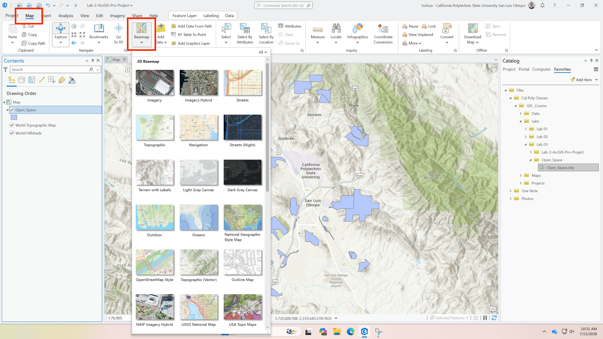

    2. After choosing a basemap, right click the basemap layer in the **Contents Pane** (EX: Light Gray Canvas) and click **zoom to layer** 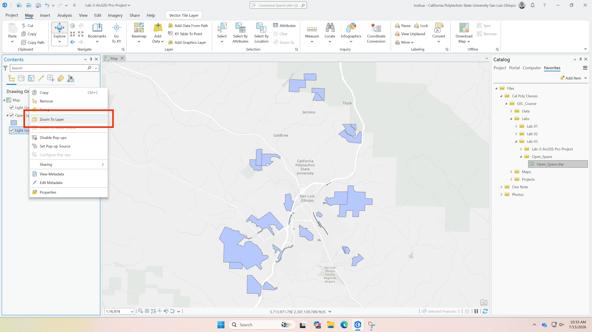

    3. Notice how your basemap appears, is it warped into the shape of a half-circle or is it rectangular? Why might it look like this? **take a screenshot** 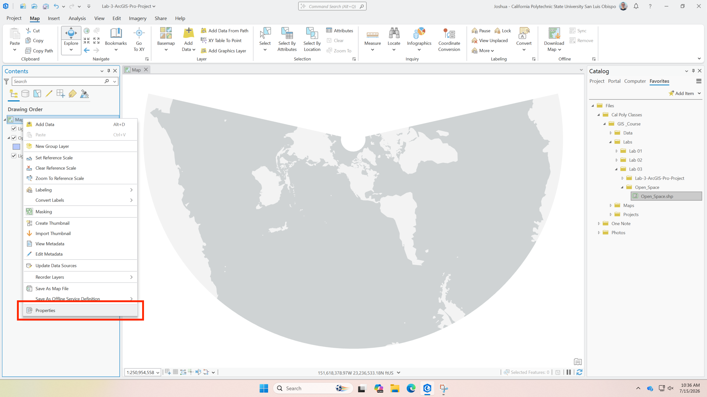

    4. In ArcGIS Pro, the map canvas is renderend based on the settings of the current map. **right click** the Map in the **Contents pane** and select **Properties** 
        
        - You'll notice that the map defaults to rendering in the CRS of the first layer added, in this case the Open_Space layer was projected to California State Plane System 5, so the map adopted that projection
    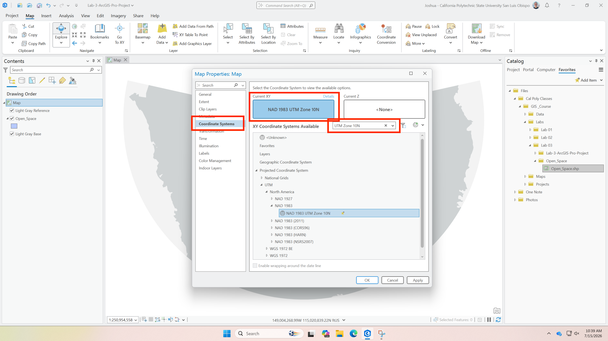

    5. Change the CRS that the Map is rendered in to **UTM Zone 10N** by going to the Coordinate Systems tab and searching for UTM Zone 10N and clicking apply or OK, **take a screenshot** 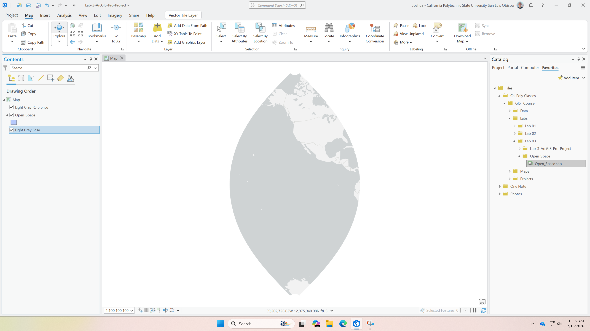

    6. Repeat step 5 for another CRS of your choice and **take a screenshot**

!!! Question "Question 2"

    Include 3 screenshots showing what your chosen basemap looks like in the following CRS's

    1. UTM Zone 10N
    2. California State Plane System Zone 5
    3. Another CRS of your choice

!!! tip "Map Canvas Rendering Differences"
    In both QGIS and ArcGIS the map canvas is rendered based on the Coordinate Reference System that is set in the **Status Bar** or **Map Properties**. 
    
    You may need to adjust how your map is rendered depending on the spatial extend of your data.

---
## Task 3: Reprojecting Vector Data

As you work on GIS projects, you may notice that each layer is in a different projection. For example, each City in California will likely project their Open space layer into their local State Plane System Zone. 

ArcGIS and QGIS can display these layers together with "on-the-fly" reprojections, but you will often run into issues when processing and combining data with different projections.

!!! Tip "Be consistent with Projections"
    When combining data from multiple sources for analysis it is best to reproject all the data into a common CRS to fit your processing needs

In this task you will prepare the SLO Open_Spaces layer to be compared to other open spaces in Northern California by reprojecting the layer into UTM Zone 10N.

=== "QGIS"

    1. Before reprojecting, set your Map Canvas back to **California State Plane Zone 5** by clicking the CRS indicator in the **Status Bar**, searching for **California State Plane Zone 5**, and clicking **OK**

        - This ensures your Map Canvas renders the Open_Spaces layer smoothly
        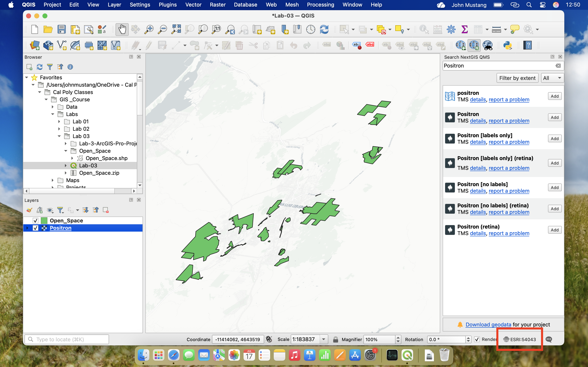 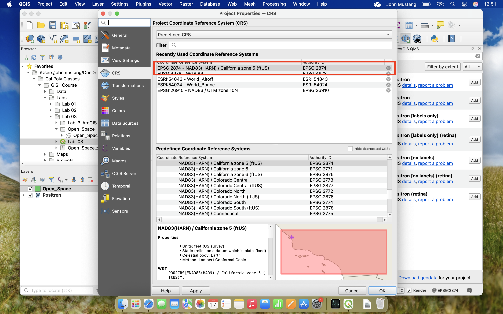

    
    2. In the **Menu Bar**, navigate to **Vector → Data Management Tools → Reproject Layer**
    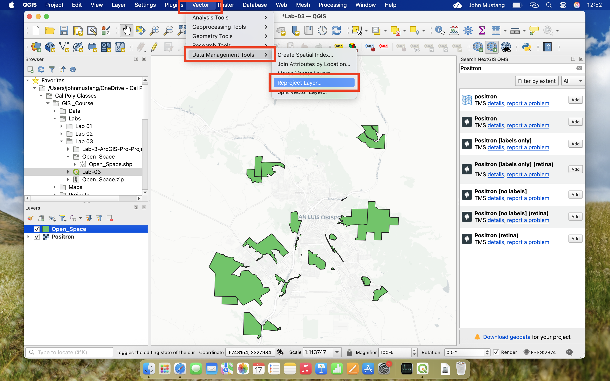

    3. In the **Reproject Layer** window, set the following parameters:

        - **Input Layer**: Open_Spaces
        - **Target CRS**: Click the browse button, search for **UTM Zone 10N**, and select **WGS 84 / UTM zone 10N (EPSG:32610)**
        - **Reprojected**: Click the **...** button and choose **Save to File...**, then browse to your Lab-03 folder and name the file `Open_Spaces_UTM10N`
        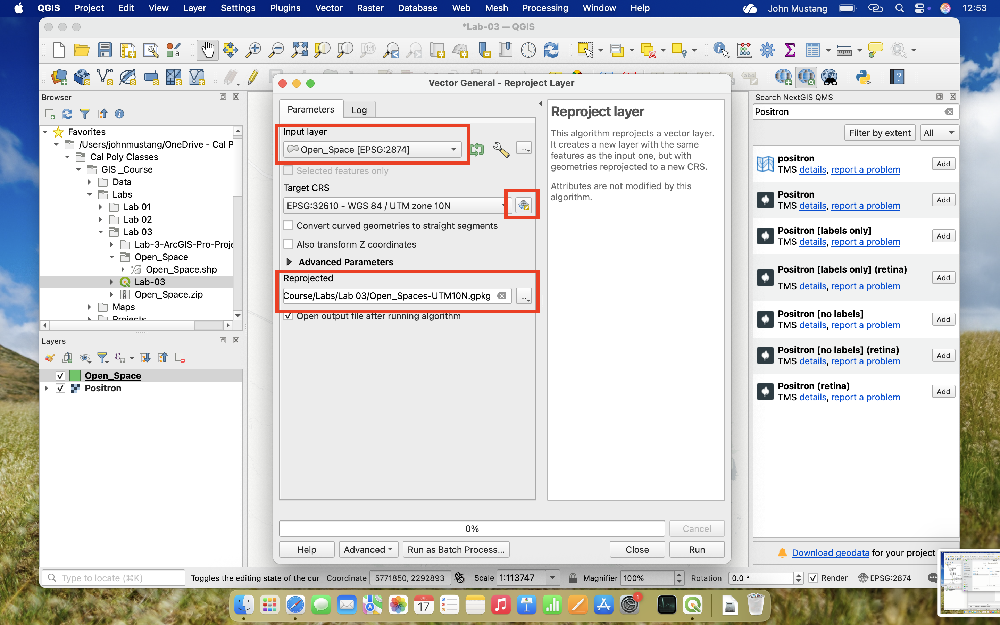 
    
    4. Click **Run**

    5. QGIS will add the new reprojected layer to your map. **Right click** the new `Open_Spaces_UTM10N` layer and select **Properties** 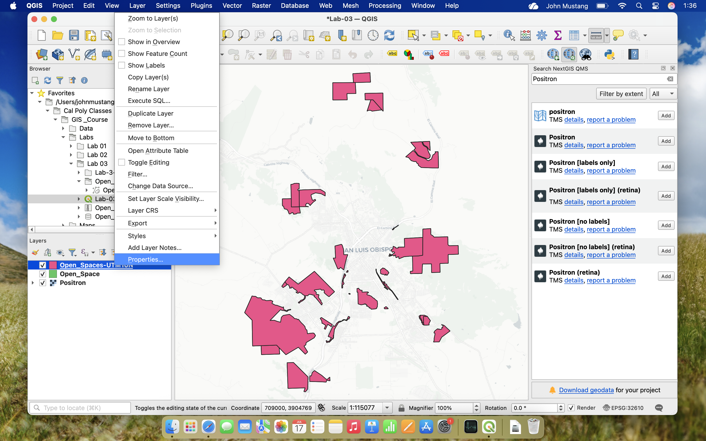

    6. Navigate to the **Information Tab** and confirm that the CRS now reads **WGS 84 / UTM zone 10N (EPSG:32610)** **take a screenshot** 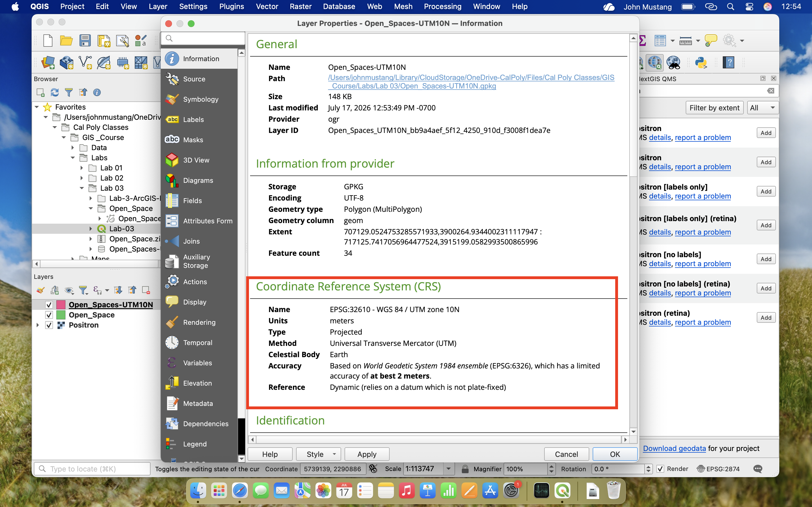

=== "ArcGIS"
    1. Reveal the **Geoprocessing Pane** in your workspace by clicking to tools button in the **Anlaysis Tab ** of the **Ribbon**

    2. Search for the **Project** Tool and input the following parameters:
        - **Input Dataset**: Open_Spaces
        - **Output Dataset**: Leave the save location as the **.gdb** and rename the layer to `Open_Spaces_UTM10N`
        - **Output Coordinate System**: Click the browse button, search for **UTM Zone 10N**, and select **WGS 1984 UTM Zone 10N**
    

    3. Click **Run**

    4. Once the tool finishes, the new layer will be added to your map. **Right click** the `Open_Spaces_UTM10N` layer in the **Contents Pane** and select **Properties**

    5. Navigate to the **Source Tab** and expand the **Spatial Reference** dropdown to confirm the CRS now reads **WGS 1984 UTM Zone 10N** **take a screenshot**
    

---
## Task 4: Measuring distances in different projections

---

## Choosing the Right Coordinate System

It is best practice to reproject your layers into a **common CRS** to ensure that geoprocessing steps are able to run without errors.

But sometimes it can be difficult to decide what CRS is best for your project, the decision framework below can help to answer the question of what CRS to use for your project.

### Decision Framework

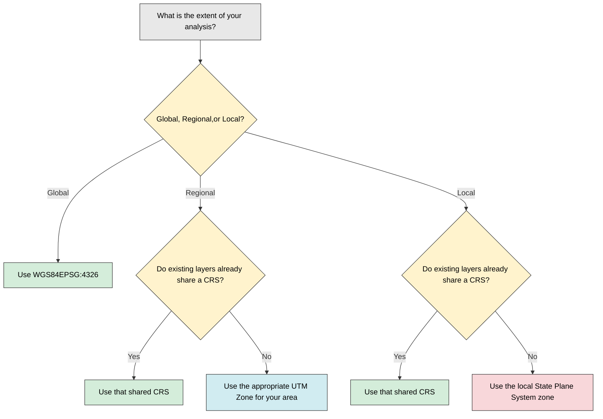

---

!!! Tip "Lab Summary"
    In this lab you practiced:

    - Identifying the CRS of a layer 
    - Visually comparing how the same data looks in different projections
    - Reprojecting vector data into a new CRS 
    - and 

[:octicons-arrow-right-24: Return to Lab Overview](overview.md)
