# Lab 3: Coordinate Systems and Projections

!!! info "Lab Overview"
    **Topic**: Working with Coordinate Systems and Map Projections
    <br>**Time Required**: 1-1.5 hours
    <br>**Software**: QGIS or ArcGIS Pro


---

## Learning Objectives
!!! note "Content Placeholder Learning Objectives"
    This lab is under development. It will cover:
    
    - **Identifying coordinate systems of layers**
    - **Comparing different projections visually**
    - Reprojecting vector data
    - Measuring distances in different projections
    - Understanding distortion
    - Reprojecting vector data
    - Resampling options for reprojecting raster data
    - Setting project coordinate systems
    - Troubleshooting projection problems

---

## Lab Preparation
 [:fontawesome-solid-download: Download Lab 3 Data](https://drive.google.com/drive/folders/131JAoMjd82VhCwQJN-MCp-RFR3sHuTAa?usp=drive_link){ .md-button }

1. Download the lab data using the link above
2. Place it in a new folder for this lab in your OneDrive ~/OneDrive/GIS_Courses/Labs/Lab-03. 
3. Unzip the Data
4. Create a new map project in QGIS or ArcGIS and save it to your Lab-03 folder

---

## Task 1: Identifying Coordinate Systems of Layers

As you work with spatial data, you will often need to ensure that all your layers are projected into the same coordinate system. Follow the steps below to identify the CRS of the Open Spaces layer from the lab data.

=== "QGIS"

    Information about the Coordinate Reference System of a layer in QGIS can be found in the Source tab of the properties pane for that layer.

    1. Add the SLO Open Spaces layer from the Browser Pane by navigating to the */GIS_Courses/Labs/Lab-03* folder in your OneDrive
    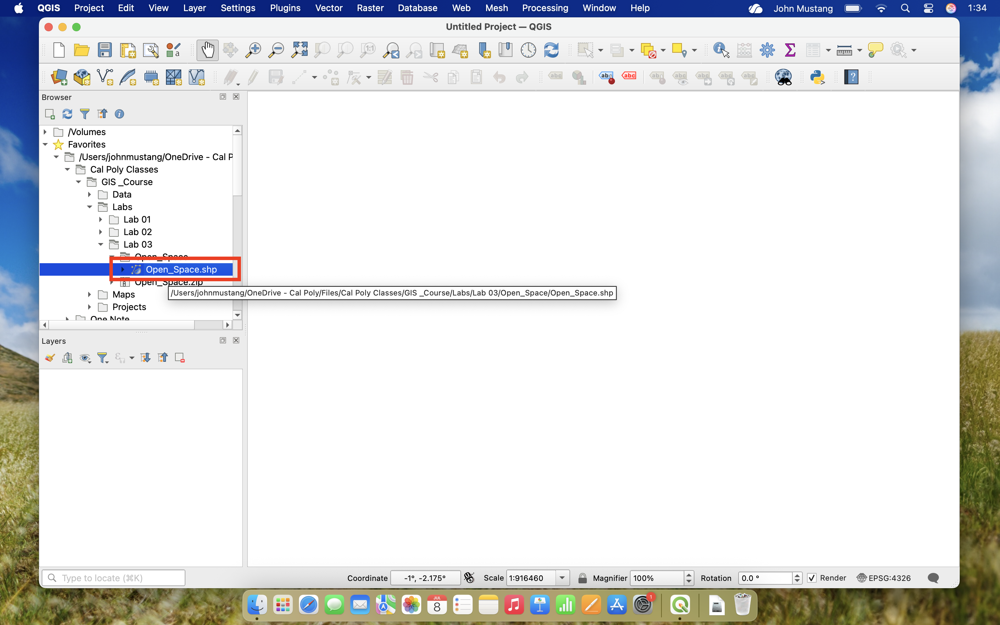
    2. Right Click the Open_Spaces layer and select **Properties**
    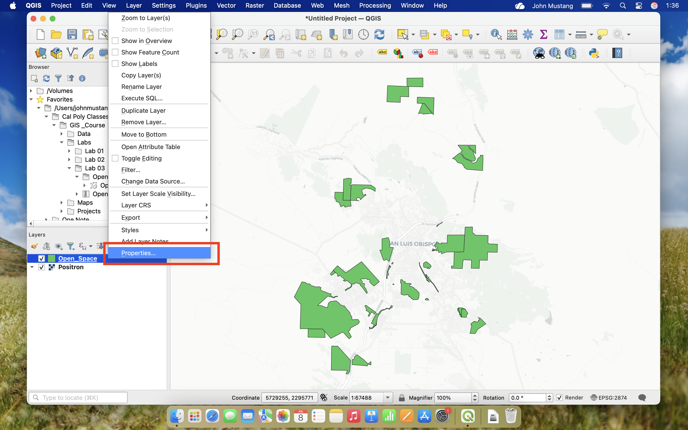
    3. Navigate to the **Information Tab**
    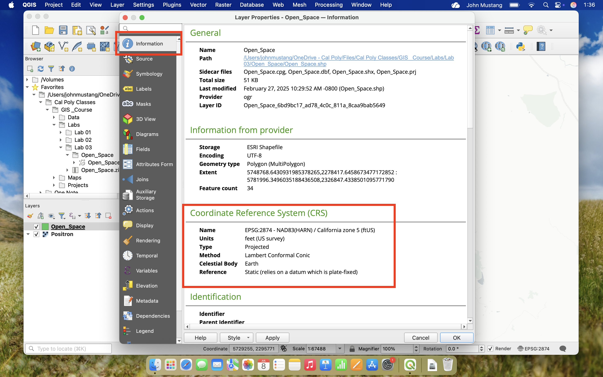
    4. Find the CRS of the layer under Coordinate Reference System (CRS) -> Name


=== "ArcGIS"

    1. Add the SLO Open Spaces layer to a new map using the Catalog Pane by navigating to GIS_Course/Labs/Lab-03 folder in your OneDrive
    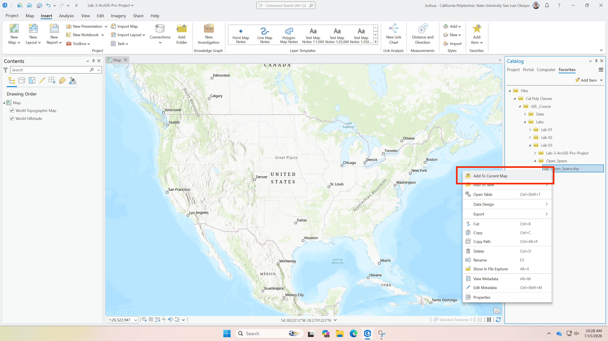
    2. Right click the Open_Spaces layer and select **Properties**
    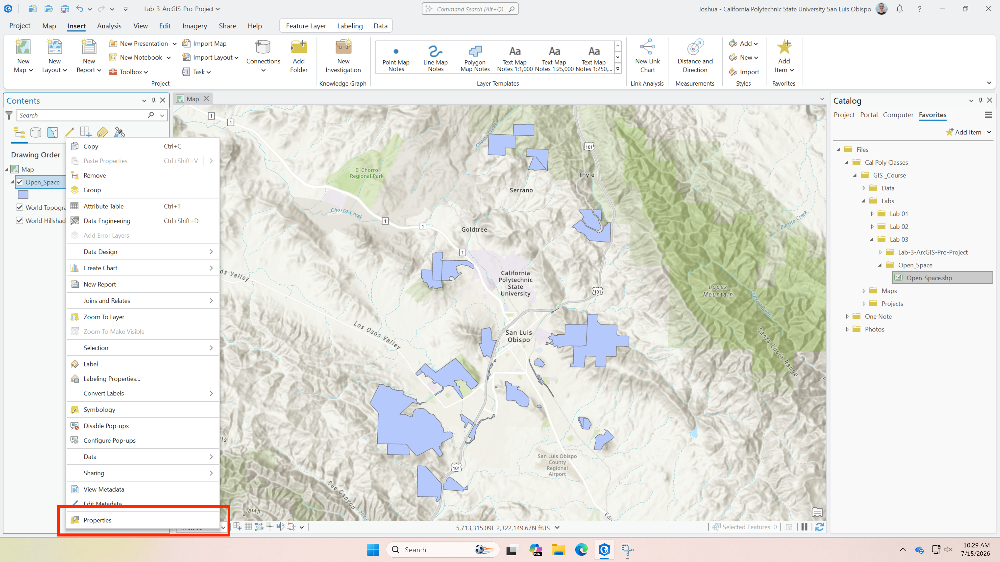
    3. Navigate to the **Source Tab**
    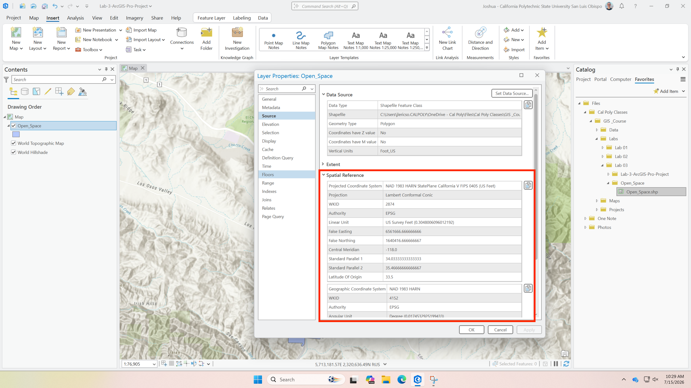
    4. Expand the Spatial Reference dropdown to see Coordinate Reference System information

    
    Animation from [mapping 101 blog](https://www.mapping101.com/skills/arcgispro-identifycrs) by *Meisterlin Projects*

!!! question "Question 1"
    - What is the EPSG code for the CRS of *Open_Spaces.shp* from the Lab 3 Data? 
    - Is the CRS a Geographic or Projected Coordinate System and how do you know?

---

## Task 2: Comparing Projections Visually
As mentined in the [Coordinate Systems Topic](../topics/03-coordinate-systems.md), each Coordinate Reference Systems has a different visual appearance depending on the distortions inherent in that projection.

This activity will guide you through changing the CRS that your GIS software renders a map in and prompt you to consider why each projection looks different


=== "QGIS"
    1. In your Lab 03 Map, add your preferred basemap using the QuickMapsServices plugin (screenshots use [Positron](https://openmaptiles.org/styles/#positron))
    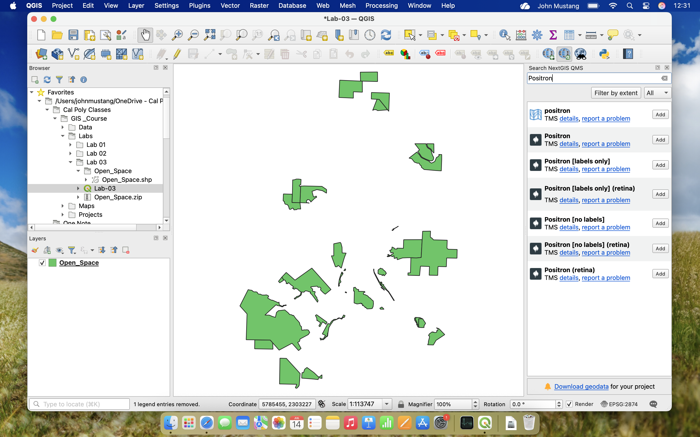

    2. After adding a basemap, right click the basemap in the **layers panel** and click **zoom to layer** 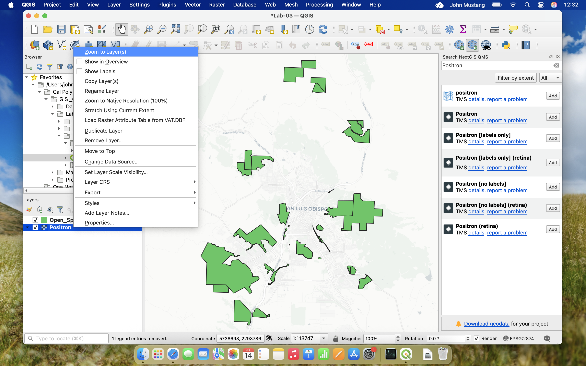

    3. Notice how your basemap appears, is it warped into the shape of a half-circle or is it rectangular? **take a screenshot** 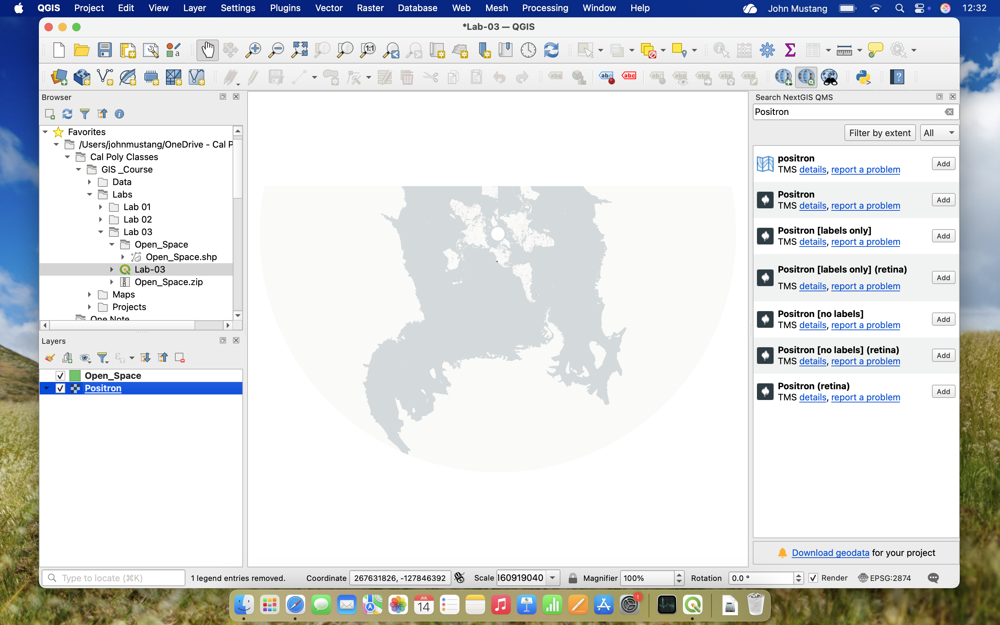

    4. In QGIS, the map canvas is rendered using a set CRS that you can inspet and adjust by clicking the EPSG: XXXX indicaor in the **Status Bar** 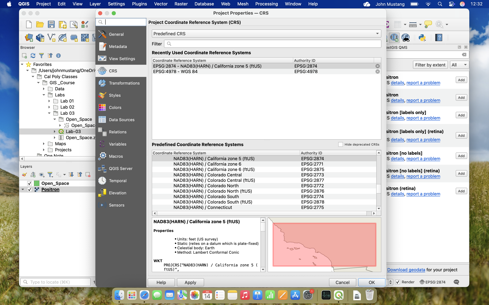

    5. Change the rendering CRS to **UTM Zone 10N** by searching for UTM Zone 10N, and clicking apply or OK, **take a screenshot** 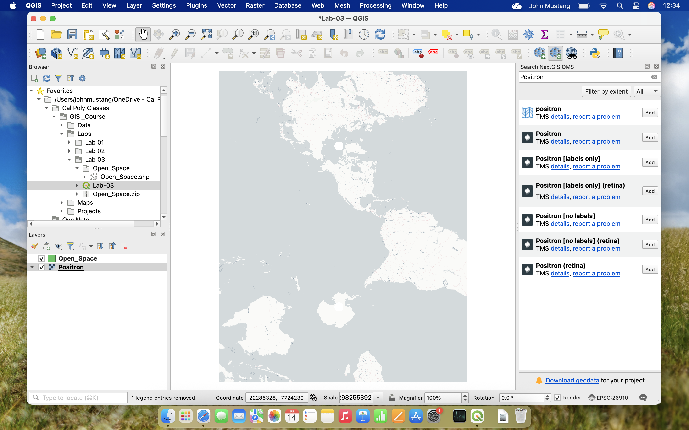

    6. Repeat step 5 for another CRS of your choice and **take a screenshot**

=== "ArcGIS"
    1. Switch to your prefered basemap by using the **Basemap** button in the Map Ribbon (Screenshots use Light Gray Canvas)

    2. After choosing a basemap, right click the basemap layer (EX: Light Gray Canvas) and click **zoom to layer**

    3. Notice how your basemap appears, is it warped into the shape of a half-circle or is it rectangular? **take a screenshot**

    4. In ArcGIS Pro, the map canvas is renderend based on the settings of the current map. **right click** the Map in the **Contents pane** and select Properties

    5. Change the CRS that the Map is rendered in to **UTM Zone 10N** by going to the Coordinate Systems tab and searching for UTM Zone 10N and clicking apply or OK, **take a screenshot**

    6. Repeat step 5 for another CRS of your choice and **take a screenshot**

!!! Question "Question 2"

    Include 3 screenshots showing what your chosen basemap looks like in the following CRS's

    1. UTM Zone 10N
    2. California State Plane System Zone 5
    3. Another CRS of your choice

!!! tip "Map Canvas Rendering Differences"
    In both QGIS and ArcGIS the map canvas is rendered based on the Coordinate Reference System that is set in the **Status Bar** or **Map Properties**. 
    
    You may need to adjust how your map is rendered depending on the spatial extend of your data.


---
## Task 3: Reprojecting Vector Data

=== "QGIS"
    1. 

=== "ArcGIS"

---
## Task 4: Measuring distances in different projections

---

## Choosing the Right Coordinate System

### Decision Framework

```
Is your analysis global or regional?
│
├─ Global → Use WGS84 (EPSG:4326)
│
└─ Regional
   │
   ├─ Do you need to measure distances/areas?
   │  │
   │  ├─ Yes → Use UTM for your zone
   │  │         or State Plane if in US
   │  │
   │  └─ No → WGS84 is fine
   │
   └─ What's your existing data in?
      → Consider matching existing CRS
        to avoid reprojection errors
```

### Best Practices

1. **Check your data**: Always verify the CRS of new data
2. **Project early**: Reproject at the start of your workflow
3. **Match your region**: Use UTM zone that covers your study area
4. **Document everything**: Note which CRS you used and why
5. **Never assume**: Even if data displays correctly, check the CRS!

---
## Troubleshooting Common Issues

### "My Layers Don't Align"

**Cause**: Different coordinate systems or datums

**Solution**:
1. Check CRS of each layer (Layer Properties → Information)
2. Reproject all to same CRS
3. Verify they align properly

---

### "My Distances are Wrong"

**Cause**: Measuring in geographic coordinates (degrees)

**Solution**:
- Reproject to projected CRS (UTM, State Plane)
- Re-measure in appropriate units

---

### "Reprojection Failed"

**Cause**: Missing projection files or corrupted data

**Solution**:
- Verify data isn't corrupted
- Try different reprojection method
- Check for required transformation grids

---

[:octicons-arrow-right-24: Return to Lab Overview](overview.md)
