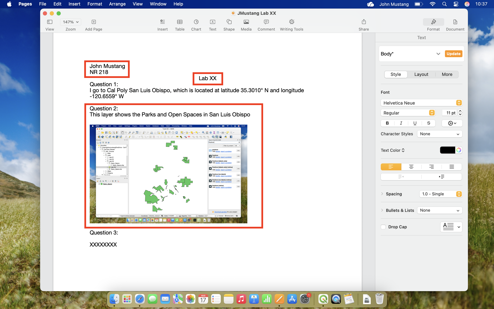

# Lab Exercises Overview

The Lab activities for this course are designed to compliment the topic lessons by providing hands-on activities to practice GIS skills and concepts.

## Lab Structure

Below is an example of what lab pages will look like:

---
## Lab XX: Example Lab

### Lab Preparation

[:fontawesome-solid-download: Example Lab Download Link](link){ .md-button }

Labs Include a data download link and instructions for lab setup.

### Introduction

!!! note "Learning Objectives"
   Each lab will include a list of learning objectives that look like this:

   - Objective 1
   - Objective 2

### Task XX: How to use Instructions
Labs include instructions and screenshots for how to do various skills in both QGIS and ArcGIS Pro

=== "QGIS"
   1. Steps will look like this and will provide exact instructions for how to do things and the **tools** will be bolded. 

=== "ArcGIS"
   1. Steps will look like this and will provide exact instructions for how to do things and the **tools** will be bolded. 

!!! Question "Question XX"
   Questions are formatted like this and will often ask for screenshots

---

### Lab Deliverables

Labs are designed to have 3-5 tasks to practice GIS skills related to that topic's concepts. Each task has a question or prompt to take a screenshot. 

Submit your responses to these questions and screenshots, in the form of a .pdf by creating a document in your preferred word processor. Create a heading with your name, the course number, and a title with the lab number. Write your answer to the question or embed your screenshot into the document for each task.

After finishing the lab, **export the document to a .pdf file** and submit to your Canvas Course.

*Instructure Article: [How do I submit an online assignment?](https://community.instructure.com/en/kb/articles/661210-how-do-i-submit-an-online-assignment)*

## Available Labs

### Foundation Labs (Weeks 1-4)

1. **[Lab 1: Creating Your First Map](lab01.md)** ✅ COMPLETE
    *Navigate GIS software, load data, create a map layout*

2. **[Lab 2: Vector Data & Attributes](lab02.md)** 🚧 PLACEHOLDER
    *Work with attribute tables, selections, and queries*

3. **[Lab 3: Coordinate Systems](lab03.md)** 🚧 PLACEHOLDER
    *Understand and work with projections*

4. **[Lab 4: Data Creation & Editing](lab04.md)** 🚧 PLACEHOLDER
    *Digitize features, edit geometry and attributes*

### Intermediate Labs (Weeks 5-10)

5. **Lab 5: Joins & Queries** 🚧 PLACEHOLDER
6. **Lab 6: Vector Geoprocessing** 🚧 PLACEHOLDER
7. **Lab 7: GPS Data** 🚧 PLACEHOLDER
8. **Lab 8: Terrain Analysis** 🚧 PLACEHOLDER
9. **Lab 9: Raster Analysis** 🚧 PLACEHOLDER
10. **Lab 10: Remote Sensing** 🚧 PLACEHOLDER

### Advanced Labs (Weeks 11-12)

11. **Lab 11: Interpolation** 🚧 PLACEHOLDER
12. **Lab 12: Workflows** 🚧 PLACEHOLDER

---

## Lab Data

Lab datasets are available for download:

- **Lab 1 Data**: [Download](link-to-data)
- **Complete Dataset Package**: [Download All](link-to-all-data)

---

## Tips for Success

1. **Read through entire lab** before starting
2. **Save frequently** as you work
3. **Organize files** in clear folder structure
4. **Document your process** - take notes on what works
5. **Ask for help** when stuck - that's normal!

---

## Lab Policies

- **Collaboration**: You may discuss concepts with classmates, but submit your own work
- **Late submissions**: Follow course policy (see syllabus)
- **Partial credit**: Attempt all parts, even if you can't complete everything
- **Questions**: Use Slack/forum for technical questions

---

[:octicons-arrow-right-24: Start with Lab 1](lab01.md)
