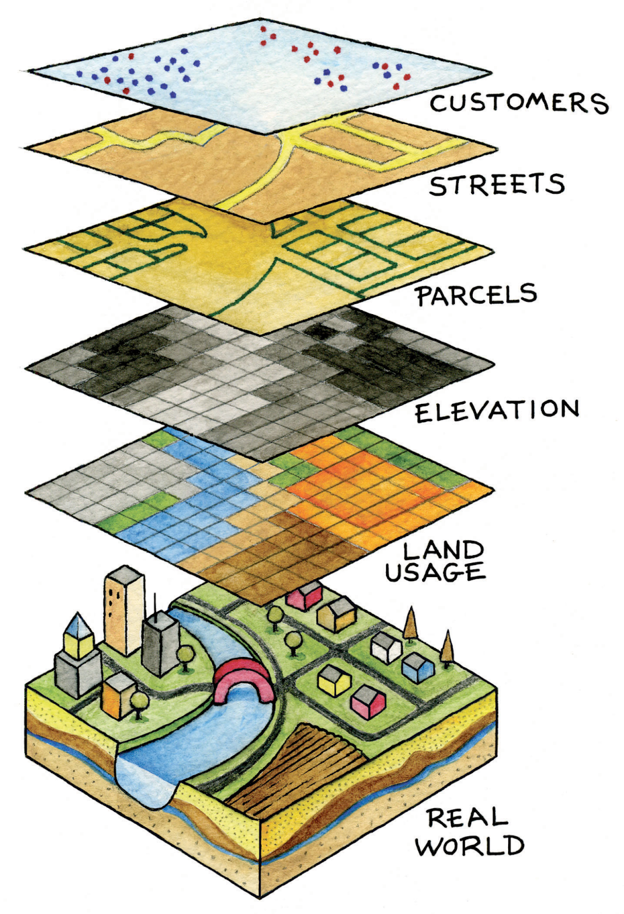
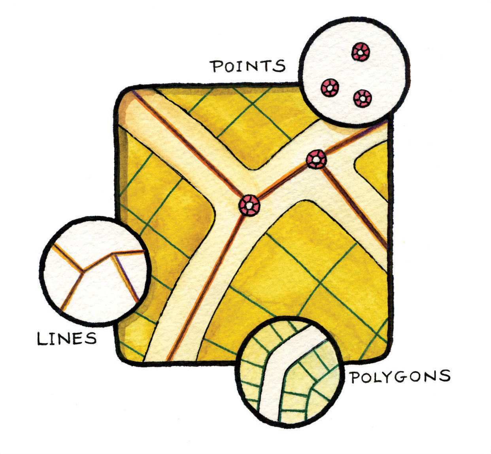
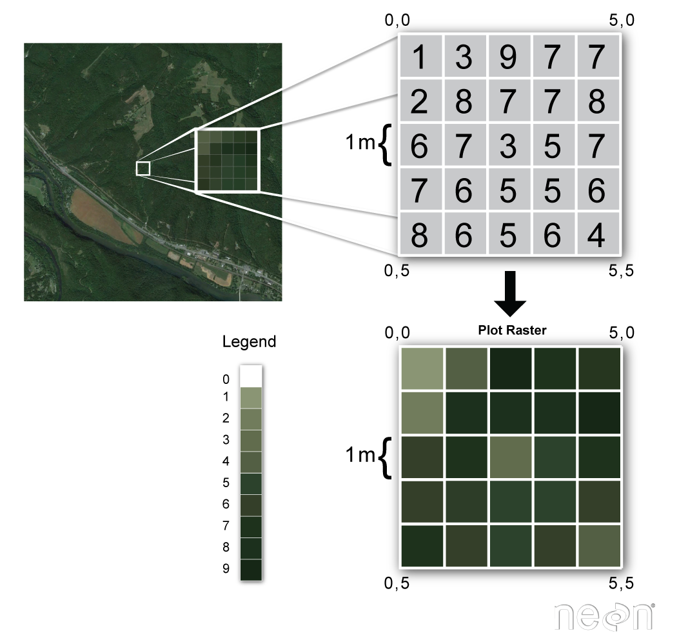
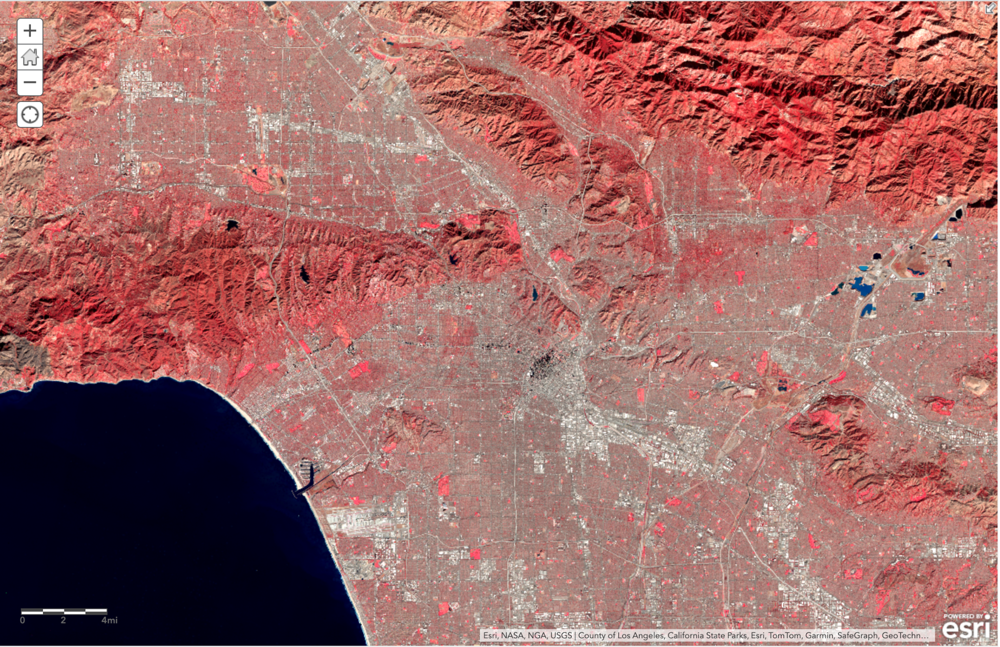
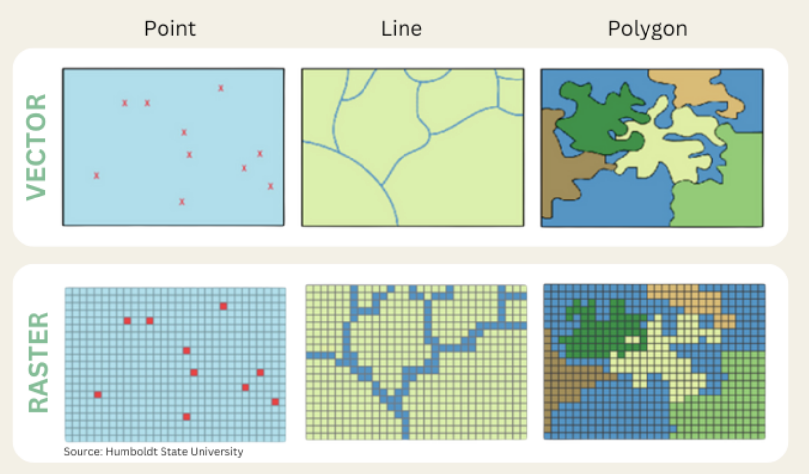
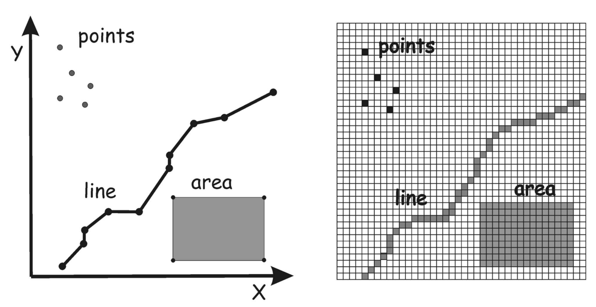

# Topic 2: Spatial Data Models and Formats

## Overview

Now that you understand what GIS is, it's time to learn how spatial information is represented and stored in a GIS. Understanding spatial data formats is fundamental to everything else you'll do with GIS!

---

## Learning Objectives

By the end of this topic, you should be able to:

- Distinguish between vector and raster data models
- Understand when to use discrete vs. continuous representations
- Identify the three vector geometry types: points, lines, and polygons
- Explain what attribute tables are and how they link to spatial features
- Recognize common spatial data formats and their uses

---

## Two Fundamental Data Models

To represent the Real World in GIS, we must abstract our buildings, roads, environments, and topography into data formats that can be understood by a computer. 



GIS uses two primary data models to represent data:

1. **Vector Data**
Discrete features with defined boundaries

    - Distinct objects, or **features** are represented with exact locations and shapes
    - Can add attributes to categorize each feature
    - Examples: buildings, roads, or administrative boundaries
    
2. **Raster Data**
Continuous surfaces as a grid of cells

    - Data is split into **cells** that each have a value
    - Ideal for representing conditions across a large area
    - Examples: elevation, temperature, or rainfall

Think of it this way:

- **Vector** = Drawing with pens to create precise lines and points
- **Raster** = A tile mosaic with different shades and hues

!!! tip "Test your Knowledge"
    In the image below, **Which data format do each of the layers use?**

    { width=250 align=left}

    | Layer | Data Type|
    |-------|----------|
    | Customers | Vector (point) |
    | Streets | Vector (line or polygon) |
    | Parcels | Vector (polygon) |
    | Elevation | Raster (continuous) |
    | Land Usage | Raster (discrete) |

    

---

## Vector Data Model

Vector data represents geographic features using [**geometric primitives**](https://en.wikipedia.org/wiki/Geometric_primitive): points, lines, and polygons. Each feature in a vector dataset can be categorized using **attributes** to add information about the qualities of each shape.

{width=300}

Vector Data is Represented with 3 main geometry types:

**1. Points:** Represent discrete locations with X, Y (and sometimes Z) coordinates.

**2. Lines:** Sequences of connected points forming paths or linear features. 

**3. Polygons:** Closed shapes representing areas, defined by connected lines.

### Points

**Used for:**

- Sampling locations
- GPS waypoints
- Trees in an inventory
- Fire hydrants
- Weather stations

!!! example "Real World Point Data"
    A dataset of coffee shops on Yelp where each point has:
    
    - **Geometry**: Latitude/Longitude coordinates for each shop location
    - **Attributes**: Shop name, hours, rating, price level


### Lines

Sequences of connected points forming paths or linear features.

**Use Cases:**

- Roads and highways
- Rivers and streams
- Power lines
- Trails
- Political boundaries (when shown as lines)

!!! example "Real World Line Data"
    A roads dataset for google maps where each line has:
    
    - **Geometry**: Series of coordinate pairs forming the road centerline
    - **Attributes**: Road name, speed limit, number of lanes, surface type

### Polygons
Closed shapes representing areas, defined by connected lines.

**Use Cases:**

- Parcel boundaries
- Lakes and water bodies
- Census Tracts
- Land use zones
- Building footprints
- Administrative boundaries 

!!! example "Real World Polygon Data"
    A land parcels dataset where each polygon has:
    
    - **Geometry**: Coordinates defining the property boundary of each parcel
    - **Attributes**: Parcel ID, owner, area, zoning, assessed value


### Vector Data Formats:

**File formats:** .gpkg, .geojson, .dwg, .kml, .shp(.shx, .dbf, .prj, etc.)

!!! warning "Note for Shapfiles"
    It is important to know that Shapefiles require 4 or more sepearate files to open in GIS. You will need to save the 

---

## Raster Data Model

Raster data divides space into a regular **grid of cells (pixels)**, where each cell contains a value.


**File Formats:** .tiff, .tif, .bmp, etc.

### Key Raster Concepts

**Cell Size (Spatial Resolution)**

The ground area covered by one pixel
*Examples: 30m (Landsat), 10m (Sentinel), 1m (lidar)*

**Extent**
The geographic area covered by the entire grid

**Value/DN (Digital Number)**

The data stored in each cell
*Could represent elevation, temperature, reflectance, land cover class, etc.*



### Raster Data Types

Raster data can either represent **continuous or discrete** phenomena.

For example, the picture below shows a map of the NDVI or Normalized difference vegetation index of LA County. The more red an area is, the more living vegetation was detected there at the time the image was captured.



In this case, the rater represents a continuous data type, because each pixel is more or less red depending on how much vegetation is present.

| Type | Description | Discrete or Continuous |Example | 
|------|-------------|-----------|---------|
| **Integer** | Whole numbers only | Discrete |Soil Types, Land cover classes (1=forest, 2=water, etc.) |
| **Float** | Decimal numbers | Continuous | Elevation, Temperature, Soil pH |
| **Binary** | 0 or 1 only | Discrete | Burned area (0=unburned, 1=burned) |

---

## Vector vs. Raster: When to Use Each?



| Aspect | Vector | Raster |
|---|---|---|
| **Best For** | Discrete features with clear boundaries | Continuous phenomena and surfaces |
| **Precision** | Exact locations and shapes | Limited by cell size |
| **File Size** | Generally smaller (for simple features) | Can be very large (high resolution) |
| **Analysis** | Better for topology and networks | Better for surface analysis and modeling |
| **Examples** | Roads, parcels, administrative boundaries | Elevation, satellite imagery, climate surfaces |
| **Editing** | Individual features easily edited | Must edit cell by cell |

!!! tip "You Can Convert Between Models"
    - **Vector → Raster**: "Rasterizing" - assigns cell values based on vector attributes
    - **Raster → Vector**: "Vectorizing" - creates features from cell patterns
    
    

    Each time you convert between raster and vector, some data will be lost. You must use your judgement to weight the trade-offs!

---

## Attribute Tables

Both vector and raster data can have associated **attribute data** - information about each feature beyond just location.

### Vector Attribute Tables

Each row = one feature (point, line, or polygon)

Each column = one attribute

**Example: City Points Attribute Table**

| OBJECTID | CITY_NAME | STATE | POPULATION | MEDIAN_INCOME |
|----------|-----------|-------|------------|---------------|
| 1 | San Luis Obispo | CA | 47,063 | $71,317 |
| 2 | Santa Barbara | CA | 91,364 | $76,917 |
| 3 | Monterey | CA | 28,575 | $68,456 |

### Common Field (Column) Types

| Data Type | Description | Example Values |
|-----------|-------------|----------------|
| **Text/String** | Letters and characters | "Oak Street", "Residential" |
| **Integer** | Whole numbers | 42, -17, 1000 |
| **Float/Double** | Decimal numbers | 3.14159, -122.4567 |
| **Date** | Date/time values | 2025-03-15, 14:30:00 |
| **Boolean** | True/False | True, False, 1, 0 |

### Raster Attribute Tables (RATs)

For **categorical rasters**, each unique value can have attributes:

| VALUE | LAND_COVER | DESCRIPTION | COLOR |
|-------|------------|-------------|-------|
| 1 | Forest | Evergreen forest | Dark green |
| 2 | Grassland | Open grassland | Light green |
| 3 | Urban | Developed areas | Gray |
| 4 | Water | Water bodies | Blue |

---

## Data Storage Concepts

### Single File vs. Multiple Files

**Single File Formats** ✅
- GeoPackage (.gpkg)
- GeoTIFF (.tif)
- GeoJSON (.geojson)
- File Geodatabase (.gdb folder)

**Multiple File Formats** ⚠️
- Shapefile (requires .shp, .shx, .dbf, .prj minimum)
- ERDAS Imagine (.img + .ige auxiliary)

!!! tip "Best Practice"
    Always use formats that keep everything together! It's much easier to share, back up, and manage.

### Compression

Raster data can be **compressed** to reduce file size:

- **Lossless**: Perfect quality preserved (LZW, Deflate)
- **Lossy**: Some quality lost (JPEG, JPEG2000)

For analysis, always use lossless compression!

---

## Metadata: Data About Data

**Metadata** describes your spatial data:

- **What**: Content description
- **When**: Creation/modification dates
- **Who**: Author/organization
- **Where**: Geographic extent
- **Why**: Purpose and use
- **How**: Collection methods, accuracy

Good metadata is essential for:
- Understanding data limitations
- Proper use of data
- Reproducibility
- Sharing with others

---

## Discrete vs. Continuous Phenomena

Understanding whether your data represents **discrete** or **continuous** phenomena helps you choose the right model:

### Discrete Phenomena
**Definition**: Features with defined boundaries and distinct identities

**Examples:**
- Buildings
- Roads
- Political boundaries
- Soil types (categorical)

**Best Model**: Usually **vector**

### Continuous Phenomena
**Definition**: Features that vary smoothly across space without clear boundaries

**Examples:**
- Elevation
- Temperature
- Air pollution
- Rainfall

**Best Model**: Usually **raster**

### The Gray Area
Some phenomena can be represented either way:

- **Population density**: Raster surface OR census polygons with density values
- **Vegetation**: Categorical raster OR vegetation polygon types
- **Temperature**: Point measurements (vector) OR interpolated surface (raster)

!!! tip "Choice Depends On..."
    - Your analysis goals
    - Available data
    - Required precision
    - Computational resources

---

## Layers: Organizing Spatial Data

In GIS software, different datasets are managed as **layers** that can be turned on/off and reordered:

```
Map Document
├── Roads (vector lines)
├── Buildings (vector polygons)
├── Tree points (vector points)
├── Elevation (raster)
└── Satellite imagery (raster)
```

**Layer Order Matters!**

Top layers draw over bottom layers (like sheets of paper)


---

## Key Takeaways

<div class="admonition success" markdown>
<p class="admonition-title">✅ Remember These Points</p>

1. **Two data models**: Vector (discrete features) and Raster (grid cells)
2. **Three vector types**: Points, lines, polygons - each suited for different features
3. **Attribute tables link** descriptive data to spatial features
4. **Choose the right format**: GeoPackage for vector, GeoTIFF for raster
5. **Avoid shapefiles**: Use modern formats like GeoPackage
6. **Discrete vs. continuous**: Helps you pick the right data model

</div>

---

## Further Reading

- [QGIS Documentation: Vector Data](https://docs.qgis.org/3.28/en/docs/gentle_gis_introduction/vector_data.html)
- [QGIS Documentation: Raster Data](https://docs.qgis.org/3.28/en/docs/gentle_gis_introduction/raster_data.html)
- ESRI: [Vector vs Raster Data](https://www.esri.com/arcgis-blog/products/product/imagery/raster-data-vs-vector-data-in-gis/)

---

## Lab Exercise

!!! lab "Lab 2: Exploring Vector Data and Attribute Tables"
    In [Lab 2](../labs/lab02.md), you'll:
    
    - Load different types of vector data (points, lines, polygons)
    - Explore attribute tables
    - Perform basic feature selection and queries
    - Add and edit attribute fields
    - Experiment with symbology based on attributes
    
    **Time Required**: 2-3 hours
    
    [:octicons-arrow-right-24: Go to Lab 2](../labs/lab02.md)

---

## Next Topic

Now that you understand spatial data models, let's explore how we reference locations on Earth:

[:octicons-arrow-right-24: Topic 3: Coordinate Systems & Projections](03-coordinate-systems.md)
