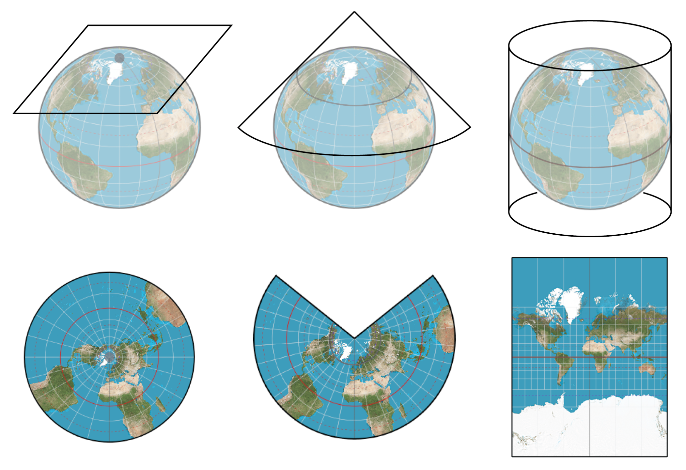
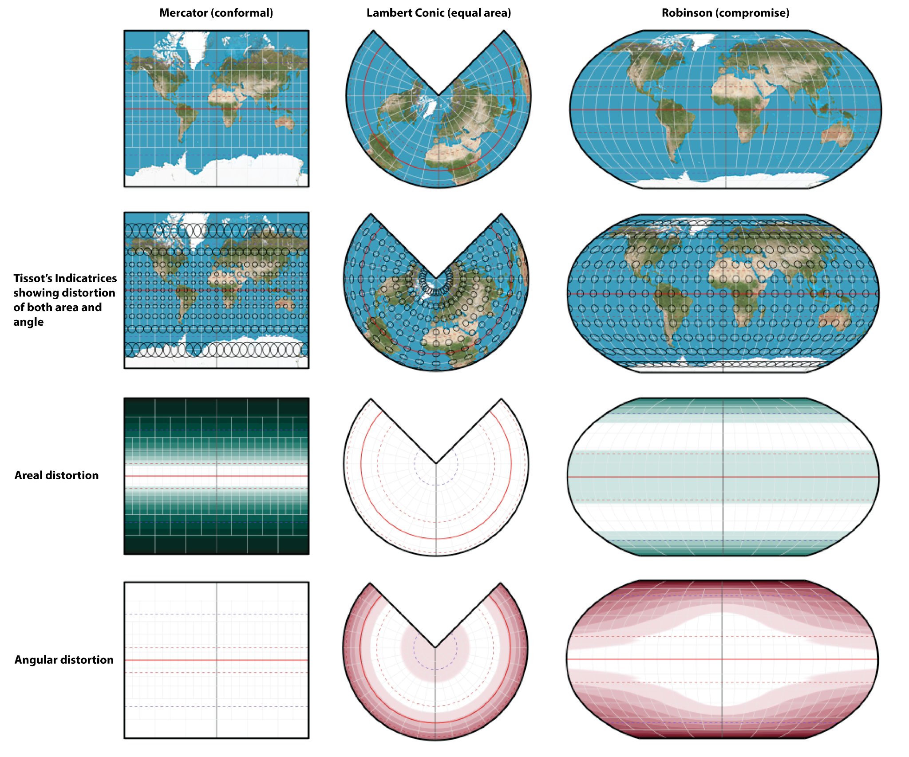
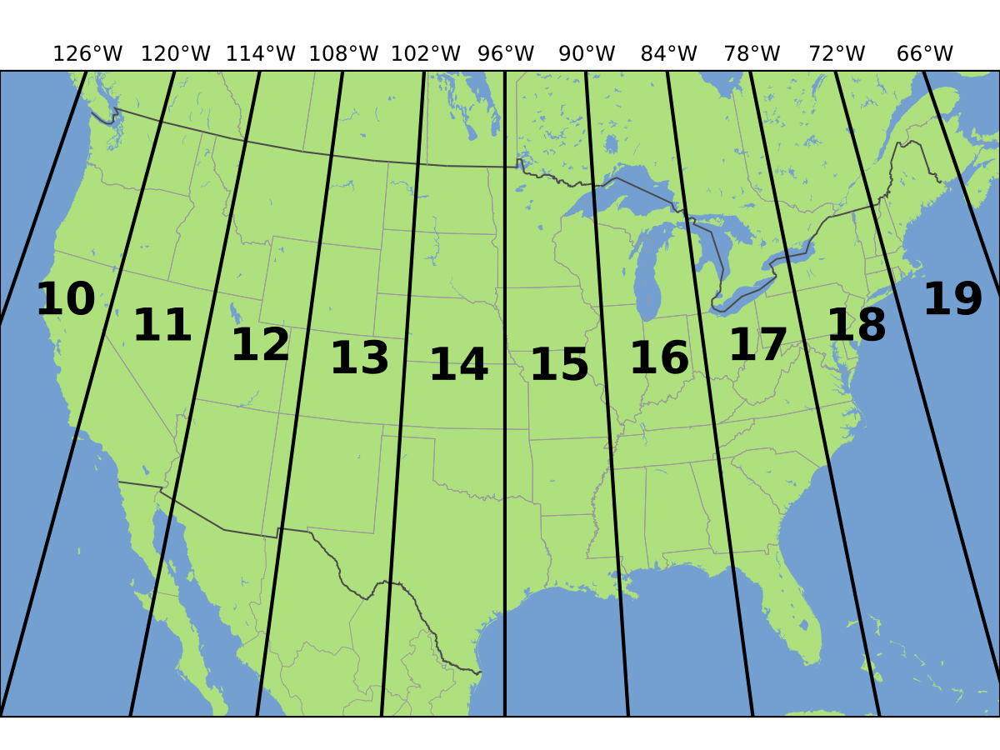
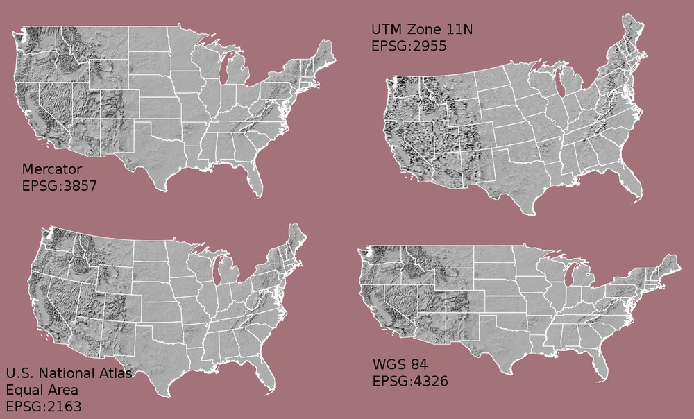

# Topic 3: Coordinate Systems, Map Projections, and Datums

## Overview

One of the most important (and often challenging) aspects of GIS is understanding how we represent the 3D Earth on a 2D map. Coordinate reference systems are the foundation of all spatial analysis - get this wrong and your entire analysis will be wrong!

!!! warning "Critical Topic"
    Understanding coordinate systems is **essential** for proper GIS work. Projection mismatches are one of the most common sources of errors in GIS projects. Taking time to master this will save you countless hours of debugging later.

---

## Learning Objectives

By the end of this topic, you should be able to:

- Distinguish between geographic and projected coordinate systems
- Explain what datums are and why they matter
- Recognize common coordinate systems (WGS84, UTM, State Plane)
- Identify types of projection distortion
- Reproject vector and raster data between coordinate systems
- Choose appropriate coordinate systems for analysis

---

## The Fundamental Challenge

### Earth is Round, Maps are Flat

**The problem**: The Earth is a 3D ellipsoid (slightly squashed sphere), but maps are 2D surfaces.

**The reality**: There is **no perfect solution** - every map projection involves some type of distortion!

Think about trying to flatten an orange peel - you'll either tear it, stretch it, or compress it. The same happens when we project Earth's surface onto a flat map.

<figure markdown>
  
  <figcaption>Unprojected globe</figcaption>
</figure>

<figure markdown>
  
  <figcaption>Globe projected onto a flat surface</figcaption>
</figure>

*[Earth Peel](https://www.esri.com/arcgis-blog/products/arcgis-pro/education/earth-peel) by John Nelson*

!!! example "Test Your Understanding"
    Check out [The True Size](https://www.thetruesize.com) to see how map projections distort the size of countries. Try dragging Greenland to the equator - you'll be surprised at how much smaller it actually is!
    <iframe src="https://thetruesize.com/#?borders=1~!MTc4MDQ1NDQ.NjY1OTM0Ng*MzYwMDAwMDA(MA~!GL*MA.MTgwMDAwMDA)Ng" width="100%" height="600px" name="The True Size of Website" scrolling="no" style="border: none; border-radius: 10px" loading="lazy" allowfullscreen sandbox="allow-scripts allow-same-origin allow-forms"></iframe>

---

## Geographic Coordinate Systems

### What is a Geographic Coordinate System?

Definition

A **Geographic Coordinate System** uses angles (latitude and longitude) to define positions on Earth's three-dimensional curved surface. 

### Key Components

**Unit of Measure**: Degrees (°)

**Coordinates**:

- **Latitude**: Measured relative to the equator
  - 0° at the equator
  - +90° at North Pole
  - -90° at South Pole
  - Lines run East-West (parallel to equator)
  
- **Longitude**: Measured relative to the Prime Meridian
  - 0° at Greenwich, England
  - +180° East
  - -180° West
  - Lines run North-South (converge at poles)

### Example Coordinates

| Location | Latitude | Longitude |
|----------|----------|-----------|
| San Luis Obispo, CA | 35.2828° N | -120.6596° W |
| Equator at Prime Meridian | 0° | 0° |
| North Pole | 90° N | Any longitude |

### The Graticule

The graticule is the network of latitude and longitude lines covering the Earth. Think of it as Earth's address system!

<figure markdown>
  { width="300" }
  <figcaption>Geographic Coordinate Systems measure location by degrees (°) of Latitude and Longitude</figcaption>
</figure>

---

## Projected Coordinate Systems

### What is a Projected Coordinate System?

Definition

A **Projected Coordinate System** transforms locations from a three-dimensional spherical coordinate system to a two-dimensional planar system - essentially, flattening the Earth onto a map.

### Key Differences from

| Aspect | Geographic | Projected |
|--------|------------------|-----------------|
| **Surface** | 3D curved (sphere/ellipsoid) | 2D flat (plane) |
| **Units** | Degrees | Linear units (meters, feet) |
| **Coordinates** | Latitude/Longitude | X/Y or Easting/Northing |
| **Measurements** | Difficult (curved surface) | Easy (flat surface) |
| **Distortion** | Minimal on globe | Always present |

### Why Use Projected Coordinates?

1. **Easy measurements**: Distances and areas are straightforward in meters/feet
2. **Accurate analysis**: Calculations work correctly on flat surfaces
3. **Practical mapping**: We view maps on flat screens and paper

!!! tip "When to Use What"
    - **Use Geographic Coordinate Systems** (lat/lon) for:
        - Global datasets
        - Web mapping (Google Maps uses WGS84)
        - Data storage and exchange
    
    - **Use Projected Coordinate Systems** (projected) for:
        - Measuring distances and areas
        - Spatial analysis
        - Local/regional mapping

---

## Map Projections: Types and Distortion

### The Three Main Projection Surfaces

Map projections use geometric surfaces that can be "unrolled" into flat maps:

| 1. Planar (Azimuthal) | 2. Conical | 3. Cylindrical |
|---|---|---|
| Projects onto a flat plane | Projects onto a cone touching Earth | Projects onto a cylinder wrapped around Earth |
| Plane touches Earth at one point | Cone "unrolls" into a flat wedge | Cylinder "unrolls" into a rectangle |
| Good for polar regions | Good for mid-latitude regions | Good for equatorial regions or world maps |
| **Examples:** Lambert Azimuthal Equal Area | **Examples:** Albers Equal Area Conic, Lambert Conformal Conic | **Examples:** Mercator, Transverse Mercator |

---

### Types of Distortion

Projections attempt to represent our irregular, 3D globe on a perfectly flat 2D plane, and therefore will always have distortions. Every map projection biased, and while it may preserve one property perfectly, it will be misrepresent **at least one** other property.

| Property | What is preserved | Projections that preserve this property |
|----------|----------------|---------------------|
| **Shape (Conformal)** | Angles and local shapes | Mercator, Lambert Conformal Conic |
| **Area (Equal-area)** | Relative sizes | Albers Equal Area, Mollweide |
| **Distance (Equidistant)** | Distances from specific points | Azimuthal Equidistant |
| **Direction (Azimuthal)** | Directions from specific points | Gnomonic |

!!! warning "You Cannot Have It All!"
    No projection can preserve shape AND area simultaneously. You must choose which property is most important for your visualization or analysis! 
    
    

    **Mercator projections** preserve shape, but distort areas, while **Conic projections** preserve area, but distort shapes. Mercator projections may be more suited to *map visualization*, while Conic projections are more suited to *statistical analysis*.

---

## Coordinate Reference Systems in GIS

Now that you understand the *concepts* of geographic and projected coordinate systems, let's connect them to the actual Coordinate Reference Systems or CRS's you'll encounter in GIS software. There are 3 major CRS categories you'll regularly encounter:

- **WGS84** - a Geographic Coordinate System
- **UTM (Universal Transverse Mercator)** - a **Global** Projected Coordinate System 
- **State Plane Coordinate Systems** - a **Local** Projected Coordinate System 

### WGS84 (EPSG:4326)

The [World Geodetic System 1984](https://en.wikipedia.org/wiki/World_Geodetic_System) is a global geographic coordinate system that is used by most modern GPS systems. WGS 84 uses latitude and longitude coordinates to locate each point on the earth on a standardized ellipsoid, and therefore codes points into angle measurement of degrees of distance from the Equator and Prime meridian.

**Key Features**:

- **Units:** Degrees (°)
- **Coordinates:** Latitude and Longitude
- **Coverage:** Global

WGS84 simplifies the earth's surface to prioritize global coverage, while obscuring localized irregularities. This makes WGS 84 ideal for worldwide datasets, and for applications in navigation systems such as GPS. 

!!! note "Remember"
    Because WGS84 is geographic, distances and areas calculated directly in WGS84 will be inaccurate — degrees are not a consistent linear unit. Reproject to a projected CRS (like UTM) before measuring.

---

### UTM (Universal Transverse Mercator)

**Category**: Projected Coordinate System — built on a Transverse Mercator projection, so coordinates are in linear units (meters), not degrees

**What is UTM?**

UTM divides the world into 60 vertical zones, each 6° of longitude wide. Each zone uses a Transverse Mercator projection optimized for that region — this is a practical example of the cylindrical projection surface discussed above, applied zone-by-zone to minimize distortion.

**Key Features**:

- **Units**: Meters
- **Coordinates**: Easting (X) and Northing (Y)
- **Zones**: Numbered 1–60 from 180°W (the international date line) eastward
- **Hemispheres**: Zones are split into North and South variants

**UTM zones covering North America**

The contiguous United States is split into 10 UTM zones, from 10N to 19N. California is split between two zones, 10N and 11N, so you must ensure that your project is using the coorect zone, depending on whether you are in the Eastern or Western half of the state.

!!! tip "UTM is Usually Your Best Choice"
    For most regional GIS analysis in the US, UTM is the appropriate choice. It provides:
    
    - Accurate distance measurements
    - Simple units (meters)
    - Minimal distortion within a zone

    Because it's a projected system, it does exactly what a projected CRS is supposed to do — trade a bit of global accuracy for reliable local measurements.

---

### State Plane Coordinate System

**Category**: Projected Coordinate System — like UTM, uses linear units and a projection optimized for a specific area, but at the scale of individual states rather than global zones

**What is State Plane?**

A coordinate system designed specifically for US states, with each state having one or more zones optimized for its shape and extent.

**Units**: Usually feet (US Survey Feet or International Feet)

**Example**: The [California State Plane Coordinate System](https://www.conservation.ca.gov/cgs/rgm/state-plane-coordinate-system) splits the state into 7 zones!

---

### Quick Reference: Which Category Is It?

| CRS | Category | Units | Typical Use |
|-----|-----------|-------|--------------|
| **WGS84** | Geographic | Degrees | GPS, web maps, global data |
| **UTM** | Projected | Meters | Regional analysis, measuring distance/area |
| **State Plane** | Projected | Feet (usually) | US state/local projects, surveying |

If you ever forget which bucket a CRS belongs to, check its units — degrees mean geographic, meters or feet mean projected.

---

## Datums: The Foundation

### What is a Datum?

All Coordinate Reference Systems (CRS's) are base their points on a standardized abstraction of the globe, know as a **datum**. You can think of a datum as the "starting point" for all measurements and operations that you make in GIS.

Definition

A **datum** is a reference framework that defines:

- The size and shape of the Earth (ellipsoid)
- The origin and orientation of coordinate systems
- How to measure positions on Earth's surface

### Why Datums Matter

The same latitude/longitude can refer to different physical locations depending on the datum that the data was coded in. This mismatch occurs because, each datums uses a different ellipsoid models to represent the irregular earth as a perfect ellipsoid. and are optimize for different regions.  This means that coordinates recorded in NAD83, but mapped in WGS 84 can differ by over 100 meters!

**Common Datums**

| Datum | Region | When Used |
|-------|--------|-----------|
| **WGS84** | Global | GPS, web mapping, modern global data |
| **NAD83** | North America | US government data, current standard |
| **NAD27** | North America | Historical US data (pre-1990s) |
| **ED50** | Europe | Historical European data |

!!! warning "Datum Mismatch = Wrong Locations"
    Always check that all your data uses the same datum! Mixing datums will cause spatial misalignment.

---

## Reprojection: Transforming Coordinate Systems

### What is Reprojection?

**Reprojection** (also called transformation or warping) is the process of converting spatial data from one coordinate system to another.

*Maps can look very distorted if they use the wrong projection*

### When to Reproject

You **must** reproject when:

1. **Mixing data sources** with different coordinate systems
2. **Measuring distances or areas** (reproject to a local projected system like UTM)
3. **Performing spatial analysis** (all layers must match!)
4. **Creating maps** (choose projection appropriate for your region)

!!! danger "Don't Skip Reprojection!"
    GIS software may display layers together even if they're in different coordinate systems, but any measurements or analysis will be WRONG!

You will learn how to reproject vector and raster data into different coordinate systems in [:octicons-arrow-right-24: Lab 3](../labs/lab03.md)

---

## EPSG Codes

**EPSG** codes are unique numeric identifiers for coordinate reference systems, maintained by the International Association of Oil & Gas Producers (formerly European Petroleum Survey Group).

### Common EPSG Codes

| Coordinate System | EPSG Code | Description |
|-------------------|-----------|-------------|
| WGS 84 | **4326** | Geographic, lat/lon, global |
| Web Mercator | **3857** | Google Maps, OpenStreetMap |
| UTM Zone 10N (WGS84) | **32610** | Western California, Oregon, Washington |
| UTM Zone 10N (NAD83) | **26910** | Same region, NAD83 datum |
| CA State Plane Zone 3 | **2227** | San Francisco Bay Area |

!!! tip "Finding EPSG codes"
    Find information about EPSG codes and find a CRS for your project at [epsg.io](https://epsg.io){:target="_blank"}

    <iframe src="https://epsg.io" width="100%" height="450px" name="EPSG" scrolling="no" style="border: none; border-radius: 10px" loading="lazy" allowfullscreen sandbox="allow-scripts allow-same-origin allow-forms"></iframe>

---

## Practical Examples

### Example 1: Local Analysis

**Task**: Measure the area of a park in San Luis Obispo

**Solution**:

1. Data comes in WGS84 (EPSG:4326)
2. Reproject to UTM Zone 10N (EPSG:32610)
3. Calculate area (result in square meters)
4. Convert to acres if needed

**Why**: UTM provides accurate area measurements

---

### Example 2: Web Mapping

**Task**: Create an interactive web map

**Solution**:

- Keep data in WGS84 (EPSG:4326) or Web Mercator (EPSG:3857)
- Most web mapping libraries expect these

**Why**: Standard for web mapping platforms

---

### Example 3: Multi-Region Study

**Task**: Compare forests in California and Colorado

**Solution**:

- California: UTM Zone 10N or 11N
- Colorado: UTM Zone 13N
- For combined analysis: Reproject both to Albers Equal Area Conic (preserves area for comparison)

**Why**: Equal-area projection preserves size relationships

## Key Takeaways

 Remember These Points

1. **No perfect projection** - all projections distort something
2. **Geographic vs Projected Coordinate Systems** - Geographic uses degrees (lat/lon), Projected uses meters/feet (X/Y)
3. **UTM for analysis** - Use UTM when measuring distances or areas regionally
4. **Always reproject** - Match all data to same CRS before analysis
5. **Check your datums** - Different datums = different positions!
6. **EPSG codes** - Use these to precisely specify coordinate systems
7. **Document your choice** - Record which CRS and why you chose it

---

## Further Reading

- [QGIS Documentation: Projections](https://docs.qgis.org/3.28/en/docs/gentle_gis_introduction/coordinate_reference_systems.html)
- [ESRI: Coordinate Systems](https://pro.arcgis.com/en/pro-app/latest/help/mapping/properties/coordinate-systems-and-projections.htm)
- [EPSG.io](https://epsg.io) - Look up any coordinate system
- Interactive: [The True Size](https://www.thetruesize.com)

---

## Lab Exercise

!!! lab "Lab 3: Working with Projections"
    In [Lab 3](../labs/lab03.md), you'll:
    
    - Identify coordinate systems of your data
    - Compare distortion in different projections visually
    - Reproject vector and raster data
    - Measure distances in different coordinate systems
    - Fix projection mismatches
    - Choose appropriate CRS for analysis
    
    **Time Required**: 2-3 hours
    
    [:octicons-arrow-right-24: Go to Lab 3](../labs/lab03.md)

---

## Next Topic

Now that you understand coordinate systems, let's learn how to create and edit spatial data:

[:octicons-arrow-right-24: Topic 4: Data Creation & Editing](04-data-creation.md)
